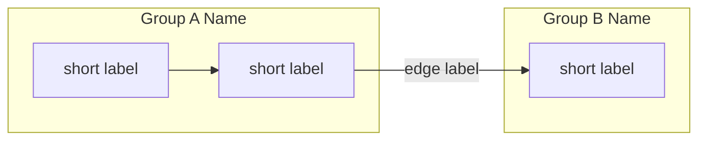
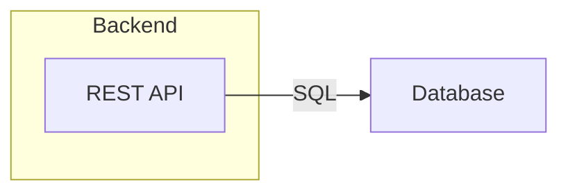

# Obsidian Canvas → Markdown + Mermaid

A **mechanical, deterministic** process for turning a `.canvas` file
(Obsidian's JSON format) into a Markdown document with Mermaid diagrams. It
was written to be followed step by step, with no creative judgment required
— any model, simple or advanced, should be able to produce the same result
by following the rules below in the order they appear.

Don't skip steps. Don't invent content that isn't in the `.canvas` file: the
final document must be traceable 1:1 to the canvas's nodes and edges.

> **Naming note:** there's also an *agent* named `canvas-to-mermaid`
> (`.claude/agents/canvas-to-mermaid.md`, same name, different namespace —
> a skill and an agent don't collide). That agent's only job is to run this
> skill end-to-end on a lightweight model; it isn't a separate or
> alternative process. Invoking this skill directly (as any agent can)
> follows the exact same steps below.

## Use the script first — don't do the mechanical part by hand

This directory has a deterministic converter, `convert.py`, which already
implements Steps 0–6 and the Step 8 checklist (geometric containment, node
classification, ID/slug generation, escaping, diagram orientation, tables).
**Run it before trying to do any of this by interpretation** — geometry
math, escaping, and ID uniqueness are exactly the kind of thing a model
(simple or not) gets wrong by inattention, and the script never gets it
wrong.

```bash
python3 <this-skill's-directory>/convert.py <input.canvas> [output.md]
```

- Requires only Python 3 (standard library, no external dependencies).
- If `output.md` is omitted, the script writes next to the input `.canvas`,
  same name with a `.md` extension.
- The script prints a report to the terminal: how many groups/nodes/text
  blocks and how many edges were translated, plus warnings (`WARNING: ...`)
  for things that need a decision from you — an edge pointing at a
  nonexistent node (likely an error in the original canvas: warn the user),
  an empty group, more than one text block. **Read this report before
  considering the task done.**
- The script does **not** generate Step 7 (sequence diagrams) — that stays
  optional and manual, only when it makes sense (see below).
- After running it, open the generated `.md` and check that the content
  makes sense before delivering it. If the script fails (a canvas format it
  doesn't recognize, a parsing error), only then fall back to the manual
  algorithm described in the steps below — they document exactly the same
  logic the script implements, for when running code isn't an option.

## Manual algorithm (what the script does under the hood / fallback without Python)

## Step 0 — Read the file and understand the format

A `.canvas` is plain JSON shaped like this:

```json
{
  "nodes": [ { ... }, { ... } ],
  "edges": [ { ... }, { ... } ]
}
```

### `node` types

| `type`   | Relevant fields                              | Meaning |
|----------|-----------------------------------------------|---------|
| `text`   | `text` (Markdown string)                      | A loose block of text on the canvas. |
| `group`  | `label` (string)                              | A container rectangle that visually groups other nodes. Has no content of its own, just a label. |
| `file`   | `file` (relative path)                        | A reference to a file embedded in the vault. |
| `link`   | `url` (string)                                | A reference to an external URL. |

Every node also has: `id` (unique string), `x`, `y`, `width`, `height`
(numbers — position and size of the rectangle on the canvas), and optionally
`color`.

### `edge` fields

```json
{ "id": "...", "fromNode": "<id>", "fromSide": "top|right|bottom|left",
  "toNode": "<id>", "toSide": "top|right|bottom|left", "label": "optional" }
```

`fromSide`/`toSide` only affect where the arrow visually touches the
rectangle — **they don't change the relationship's logical direction**. The
logical direction is always `fromNode → toNode`.

Read the whole file before moving on. If it's large, still read the entire
JSON — the next step depends on comparing every node against every other
one.

## Step 1 — Determine which group each node belongs to

Groups (`type: "group"`) are containers. A node belongs to a group if the
node's rectangle is **fully contained** within the group's rectangle.
Compute it like this, for each pair (group G, node N) where N isn't G
itself:

```
contained(N, G) =
    N.x            >= G.x
    AND N.x + N.width  <= G.x + G.width
    AND N.y            >= G.y
    AND N.y + N.height <= G.y + G.height
```

Rules:

- If N is contained in more than one group, it belongs to the **smallest**
  group (smallest `width * height`) — this resolves nested groups.
- A `group` can be contained within another `group` (a subgroup). Treat this
  as nested `subgraph`s in Mermaid (Step 5).
- Nodes not contained in any group are "loose" — they stay outside any
  `subgraph` in the diagram, or, if they're a long text block (see Step 2),
  they become the document's introductory text instead of a diagram node.

By the end of this step you should have a list: `group → [child nodes]`,
including a virtual "no group" bucket for the loose ones.

## Step 2 — Classify each `text` node: description or component?

Not every text node is a diagram box. Apply this simple rule:

- **Descriptive block** (becomes prose introduction, not a diagram box) if
  the node:
  - doesn't belong to any group, **and**
  - its `text` is longer than ~200 characters OR contains a Markdown
    heading (`#`).
- **Component** (becomes a diagram box) in every other case — usually a
  short phrase, 1–2 lines, describing a piece of the system.

There should only ever be a handful of descriptive blocks per canvas
(typically just one: the project overview). If there's more than one, put
them in order of appearance (top-left to bottom-right, by `y` then `x`) in
the document's introduction.

## Step 3 — Build the component tables (one per group)

For each top-level group, generate a `## <group label>` section with a
table (nested groups drop one heading level each, `###`, `####`, ...):

| Component | Description |
|---|---|
| `<node text, first line or sentence>` | `<full node text>` |

Use the `text` node's full text as the description — don't summarize or
invent details that aren't there. If the node is `type: "file"` or
`type: "link"`, the "description" is the reference (`File: <file>` or
`Link: <url>`).

This guarantees that **every** node in the canvas ends up somewhere in the
final document — use this list as your completeness checklist in Step 8.

## Step 4 — Prepare nodes for Mermaid

For every node that becomes a diagram box:

1. **Mermaid ID = a readable slug derived from the label.** Generate a short
   UPPERCASE/ASCII identifier from the first 1–3 meaningful words of the
   `text` (no accents, spaces become `_`) — e.g., "Session/State Manager" →
   `SESSION`. If the slug collides with one already in use, append a
   numeric suffix (`_2`, `_3`, ...). **Don't use the canvas's hex `id` as
   the Mermaid ID**: besides making the diagram's code unreadable for
   whoever maintains the document later, Obsidian canvas IDs often start
   with a digit (e.g., `0039b035...`), which is unsafe in some Mermaid
   parsers. The `canvas id → slug` mapping is only your own mental scratch
   pad — it doesn't need to appear in the final document.
2. **Label:** take the first sentence/line of the `text` (up to the first
   `.` or line break, whichever comes first). If the original text has
   multiple lines, join them with `<br/>` inside the label instead of a real
   line break.
3. **Escaping:** replace double quotes `"` with `'` inside the label (the
   node's label itself already goes between double quotes in Mermaid:
   `ID["label"]`).
4. **Truncation:** if the label goes over ~60 characters, cut it and use an
   ellipsis in the diagram — the full text is already preserved in the
   Step 3 table.

## Step 5 — Write the `flowchart`

Assemble a block like this, `flowchart LR` (left→right) or `flowchart TD`
(top→bottom) — choose `LR` if the canvas is wider than it is tall, `TD`
otherwise (compare the sum of group widths vs. heights):



`edge` → arrow translation rules:

- No `label`: `FROM --> TO`
- With `label`: `FROM -- "label" --> TO`
- Every `subgraph ... end` must be balanced — double-check the count before
  finishing.
- Loose nodes (outside any group) are declared outside any `subgraph`, at
  the flowchart's root level.
- Don't reorder or reverse edges: the direction is always
  `fromNode → toNode`, regardless of `fromSide`/`toSide`.

## Step 6 — Assemble the final document

Fixed structure of the output `.md` file:

```markdown
# <Title>

<text of the descriptive block(s) from Step 2, verbatim>

## Architecture overview

<mermaid block from Step 5>

## <Group 1 Name>

<table from Step 3>

## <Group 2 Name>

<table from Step 3>

...
```

- `<Title>`: use the first `#` found inside the Step 2 descriptive block; if
  there isn't one, use the `.canvas` file's name without the extension.
- **Don't duplicate the title:** if the descriptive block already starts
  with that `# ...` line, strip that first line (and the following blank
  line) from the text before pasting it as the body — it already became the
  document's `<Title>`.
- If there's no descriptive block at all, omit the introduction and start
  directly with the overview.

## Step 7 (optional, only with room for extra context/capacity) — Flow diagrams

This is **optional** and requires more judgment — skip it if you're using a
simple model or if the canvas has no clear cause→effect chains. If you do
it:

1. Look for chains of connected edges (A→B→C→D) that cross multiple groups —
   this usually represents an end-to-end use case or data flow.
2. For each chain found, generate a Mermaid `sequenceDiagram` with one
   `participant` per node involved (in the order they appear in the chain)
   and one `A->>B: <edge label or action name>` arrow per edge in the chain.
3. Put these diagrams in a `## Main flows` section before the component
   tables, or after them — keep it consistent.

## Step 8 — Validation checklist before delivering

Before writing the final file, check:

- [ ] Every `node` in the JSON appears somewhere in the `.md` (as a diagram
      box, a table row, or part of the introduction). No node was silently
      dropped.
- [ ] Every `edge` in the JSON became an arrow in the flowchart (none left
      over).
- [ ] Every opened `subgraph` has a matching `end`.
- [ ] No node/edge label contains unescaped double quotes.
- [ ] The introduction's text is a literal copy of the descriptive node, not
      a summary.

## Minimal example (step-by-step mapping)

Input canvas:

```json
{
  "nodes": [
    {"id":"g1","type":"group","x":0,"y":0,"width":300,"height":200,"label":"Backend"},
    {"id":"n1","type":"text","x":20,"y":20,"width":150,"height":50,"text":"REST API"},
    {"id":"n2","type":"text","x":400,"y":20,"width":150,"height":50,"text":"Database"}
  ],
  "edges": [
    {"id":"e1","fromNode":"n1","fromSide":"right","toNode":"n2","toSide":"left","label":"SQL"}
  ]
}
```

- Step 1: `n1` is contained in `g1` (0≤20, 170≤300, 0≤20, 70≤200) →
  belongs to "Backend." `n2` isn't contained in `g1` (400 > 300) → loose.
- Step 2: both `text` nodes are short → they become components, not
  introduction.
- Step 3/5 → result:



(`g1`/`n1`/`n2` from the JSON became the slugs `BACKEND`/`REST_API`/`DATABASE`
— never the raw hex IDs, see Step 4.)

This is the level of literalness expected: nothing is inferred beyond what
the JSON fields already say.
