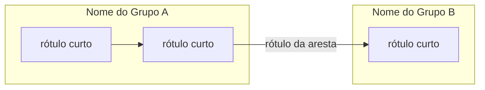
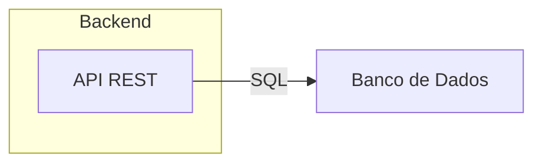

# Canvas do Obsidian → Markdown + Mermaid

Processo **mecânico e determinístico** para transformar um arquivo `.canvas` (JSON do
Obsidian) em um documento Markdown com diagramas Mermaid. Foi escrito para ser seguido
passo a passo, sem exigir julgamento criativo — qualquer modelo, simples ou avançado,
deve conseguir produzir o mesmo resultado seguindo as regras abaixo na ordem em que
aparecem.

Não pule etapas. Não invente conteúdo que não esteja no arquivo `.canvas`: o documento
final deve ser rastreável 1:1 aos nós e arestas do canvas.

## Use o script primeiro — não faça a parte mecânica de cabeça

Este diretório tem um conversor determinístico, `convert.ts`, que já implementa os
Passos 0–6 e a checklist do Passo 8 (containment geométrico, classificação de nós,
geração de IDs/slugs, escaping, orientação do diagrama, tabelas). **Rode-o antes de
tentar fazer qualquer parte disso por interpretação própria** — contas de geometria,
escaping e unicidade de ID são exatamente o tipo de coisa que um modelo (simples ou
não) erra por distração, e o script nunca erra isso.

```bash
node <diretório-desta-skill>/convert.ts <entrada.canvas> [saida.md]
```

- Requer Node.js 22.6+ (roda `.ts` nativamente, sem instalar nada). Se o ambiente não
  suportar, tente `npx tsx <diretório-desta-skill>/convert.ts ...`.
- Se `saida.md` for omitido, o script grava ao lado do `.canvas` de entrada, mesmo nome
  com extensão `.md`.
- O script imprime no terminal um relatório: quantos grupos/nós/blocos descritivos e
  quantas arestas foram traduzidas, mais avisos (`AVISO: ...`) para coisas que exigem
  uma decisão sua — aresta apontando para um nó inexistente (provável erro no canvas
  original: avise o usuário), grupo vazio, mais de um bloco descritivo. **Leia esse
  relatório antes de considerar a tarefa concluída.**
- O script **não** gera o Passo 7 (diagramas de sequência) — isso continua sendo
  opcional e manual, só quando fizer sentido (ver abaixo).
- Depois de rodar, abra o `.md` gerado e confira se o conteúdo faz sentido antes de
  entregar. Se o script falhar (canvas em formato que ele não reconhece, erro de
  parsing), só então recorra ao algoritmo manual descrito nos passos abaixo — eles
  documentam exatamente a mesma lógica que o script implementa, para quando não há
  como rodar código.

## Algoritmo manual (o que o script faz por baixo dos panos / fallback sem Node)

## Passo 0 — Ler o arquivo e entender o formato

Um `.canvas` é um JSON puro com esta forma:

```json
{
  "nodes": [ { ... }, { ... } ],
  "edges": [ { ... }, { ... } ]
}
```

### Tipos de `node`

| `type`   | Campos relevantes                          | Significado |
|----------|---------------------------------------------|--------------|
| `text`   | `text` (string Markdown)                    | Um bloco de texto solto no canvas. |
| `group`  | `label` (string)                            | Um retângulo-container que agrupa outros nós visualmente. Não tem conteúdo próprio, só rótulo. |
| `file`   | `file` (caminho relativo)                   | Referência a um arquivo embutido no vault. |
| `link`   | `url` (string)                              | Referência a uma URL externa. |

Todo node tem também: `id` (string única), `x`, `y`, `width`, `height` (números —
posição e tamanho do retângulo no canvas), e opcionalmente `color`.

### Campos de `edge`

```json
{ "id": "...", "fromNode": "<id>", "fromSide": "top|right|bottom|left",
  "toNode": "<id>", "toSide": "top|right|bottom|left", "label": "opcional" }
```

`fromSide`/`toSide` só afetam onde a seta encosta visualmente no retângulo — **não
alteram o sentido lógico da relação**. O sentido lógico é sempre `fromNode → toNode`.

Leia o arquivo inteiro antes de prosseguir. Se for grande, ainda assim leia todo o
JSON — a etapa seguinte depende de comparar todos os nós entre si.

## Passo 1 — Determinar quem pertence a qual grupo

Grupos (`type: "group"`) são containers. Um nó pertence a um grupo se o retângulo do
nó estiver **totalmente contido** no retângulo do grupo. Calcule assim, para cada par
(grupo G, nó N) onde N não é o próprio G:

```
contido(N, G) =
    N.x            >= G.x
    AND N.x + N.width  <= G.x + G.width
    AND N.y            >= G.y
    AND N.y + N.height <= G.y + G.height
```

Regras:

- Se N está contido em mais de um grupo, ele pertence ao **menor** grupo (menor
  `width * height`) — isso resolve grupos aninhados.
- Um `group` pode estar contido em outro `group` (subgrupo). Trate isso como
  aninhamento de `subgraph` no Mermaid (Passo 5).
- Nós que não estão contidos em nenhum grupo são "avulsos" — ficam fora de qualquer
  `subgraph` no diagrama, ou, se forem um bloco de texto longo (ver Passo 2), viram
  texto introdutório do documento em vez de nó do diagrama.

Ao final deste passo você deve ter uma lista: `grupo → [nós filhos]`, incluindo um
grupo virtual "sem grupo" para os avulsos.

## Passo 2 — Classificar cada `text` node: descrição ou componente?

Nem todo nó de texto é uma caixa de diagrama. Aplique esta regra simples:

- **Bloco descritivo** (vira introdução em prosa, não caixa de diagrama) se o nó:
  - não pertence a nenhum grupo, **e**
  - o `text` tem mais de ~200 caracteres OU contém um cabeçalho Markdown (`#`).
- **Componente** (vira caixa de diagrama) em todos os outros casos — geralmente uma
  frase curta, 1–2 linhas, descrevendo uma peça do sistema.

Só deve existir, no máximo, um punhado de blocos descritivos por canvas (tipicamente
um só: a visão geral do projeto). Se houver mais de um, coloque-os em ordem de
aparição (topo-esquerda para baixo-direita, por `y` e depois `x`) na introdução do
documento.

## Passo 3 — Montar as tabelas de componentes (uma por grupo)

Para cada grupo de nível raiz, gere uma seção `## <label do grupo>` com uma tabela
(grupos aninhados descem um nível de heading cada, `###`, `####`, ...):

| Componente | Descrição |
|---|---|
| `<texto do node, primeira linha ou frase>` | `<texto completo do node>` |

Use o texto completo do `text` node como descrição — não resuma nem invente detalhes
que não estão lá. Se o nó for `type: "file"` ou `type: "link"`, a "descrição" é a
referência (`Arquivo: <file>` ou `Link: <url>`).

Isso garante que **todo** nó do canvas apareça em algum lugar do documento final —
use essa lista como checklist de completude no Passo 8.

## Passo 4 — Preparar os nós para o Mermaid

Para cada nó que vai virar caixa de diagrama:

1. **ID do Mermaid = slug legível derivado do rótulo.** Gere um identificador curto em
   MAIÚSCULAS/ASCII a partir das 1–3 primeiras palavras significativas do `text` (sem
   acentos, espaços viram `_`) — ex.: "Gerenciador de Sessão / Estado" → `SESSAO`. Se o
   slug colidir com outro já usado, acrescente um sufixo numérico (`_2`, `_3`, ...).
   **Não use o `id` hexadecimal do canvas como ID do Mermaid**: além de deixar o código
   do diagrama ilegível para quem for manter o documento depois, IDs de canvas do
   Obsidian costumam começar com dígito (ex.: `0039b035...`), o que é inseguro em
   alguns parsers Mermaid. A correspondência `id do canvas → slug` é só um rascunho
   mental seu — não precisa aparecer no documento final.
2. **Rótulo:** pegue a primeira frase/linha do `text` (até o primeiro `.` ou quebra de
   linha, o que vier primeiro). Se o texto original tiver múltiplas linhas, junte-as
   com `<br/>` dentro do rótulo em vez de quebra de linha real.
3. **Escape:** troque aspas duplas `"` por `'` dentro do rótulo (o rótulo do nó em si
   já vai entre aspas duplas no Mermaid: `ID["rótulo"]`).
4. **Truncamento:** se o rótulo passar de ~60 caracteres, corte e use reticências no
   diagrama — o texto completo já está preservado na tabela do Passo 3.

## Passo 5 — Escrever o `flowchart`

Monte um bloco assim, `flowchart LR` (esquerda→direita) ou `flowchart TD`
(topo→baixo) — escolha `LR` se o canvas é mais largo que alto, `TD` caso contrário
(compare a soma das larguras vs. alturas dos grupos):



Regras de tradução de `edge` → seta:

- Sem `label`: `FROM --> TO`
- Com `label`: `FROM -- "label" --> TO`
- Todo `subgraph ... end` deve estar balanceado — confira a contagem antes de
  finalizar.
- Nós avulsos (fora de grupo) ficam declarados fora de qualquer `subgraph`, no nível
  raiz do flowchart.
- Não reordene nem inverta arestas: a direção é sempre `fromNode → toNode`,
  independente de `fromSide`/`toSide`.

## Passo 6 — Montar o documento final

Estrutura fixa do arquivo `.md` de saída:

```markdown
# <Título>

<texto do(s) bloco(s) descritivo(s) do Passo 2, verbatim>

## Visão geral da arquitetura

<bloco mermaid do Passo 5>

## <Nome do Grupo 1>

<tabela do Passo 3>

## <Nome do Grupo 2>

<tabela do Passo 3>

...
```

- `<Título>`: use o primeiro `#` encontrado dentro do bloco descritivo do Passo 2; se
  não houver nenhum, use o nome do arquivo `.canvas` sem extensão.
- **Não duplique o título:** se o bloco descritivo já começa com essa linha `# ...`,
  remova essa primeira linha (e a linha em branco seguinte) do texto antes de colá-lo
  como corpo — ela já virou o `<Título>` do documento.
- Se não houver bloco descritivo nenhum, omita a introdução e comece direto pela
  visão geral.

## Passo 7 (opcional, só com folga de contexto/capacidade) — Diagramas de fluxo

Isto é **opcional** e exige mais julgamento — pule se estiver usando um modelo
simples ou se o canvas não tiver cadeias claras de causa→efeito. Se for fazer:

1. Procure cadeias de arestas conectadas (A→B→C→D) que atravessem múltiplos grupos —
   isso geralmente representa um caso de uso ou fluxo de dados ponta a ponta.
2. Para cada cadeia identificada, gere um `sequenceDiagram` do Mermaid com um
   `participant` por nó envolvido (na ordem em que aparecem na cadeia) e uma seta
   `A->>B: <label da aresta ou nome da ação>` por aresta da cadeia.
3. Coloque esses diagramas em uma seção `## Fluxos principais` antes das tabelas de
   componentes, ou depois — mantenha consistente.

## Passo 8 — Checklist de validação antes de entregar

Antes de escrever o arquivo final, confira:

- [ ] Todo `node` do JSON aparece em algum lugar do `.md` (como caixa do diagrama, ou
      linha de tabela, ou parte da introdução). Nenhum nó foi silenciosamente
      descartado.
- [ ] Toda `edge` do JSON virou uma seta no flowchart (nenhuma sobrando).
- [ ] Todo `subgraph` aberto tem um `end` correspondente.
- [ ] Nenhum rótulo de nó/aresta contém aspas duplas não escapadas.
- [ ] O texto da introdução é cópia literal do node descritivo, não um resumo.

## Exemplo mínimo (mapeamento passo a passo)

Canvas de entrada:

```json
{
  "nodes": [
    {"id":"g1","type":"group","x":0,"y":0,"width":300,"height":200,"label":"Backend"},
    {"id":"n1","type":"text","x":20,"y":20,"width":150,"height":50,"text":"API REST"},
    {"id":"n2","type":"text","x":400,"y":20,"width":150,"height":50,"text":"Banco de Dados"}
  ],
  "edges": [
    {"id":"e1","fromNode":"n1","fromSide":"right","toNode":"n2","toSide":"left","label":"SQL"}
  ]
}
```

- Passo 1: `n1` está contido em `g1` (0≤20, 170≤300, 0≤20, 70≤200) → pertence a
  "Backend". `n2` não está contido em `g1` (400 > 300) → avulso.
- Passo 2: ambos os `text` são curtos → viram componentes, não introdução.
- Passo 3/5 → resultado:



(`g1`/`n1`/`n2` do JSON viraram os slugs `BACKEND`/`API_REST`/`BANCO_DADOS` — nunca os
ids hexadecimais crus, ver Passo 4.)

Esse é o nível de literalidade esperado: nada é inferido além do que os campos do
JSON já dizem.
