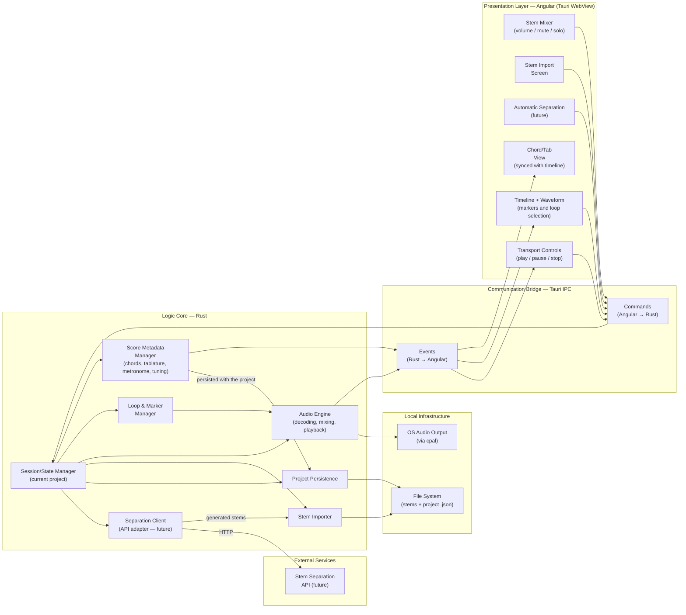
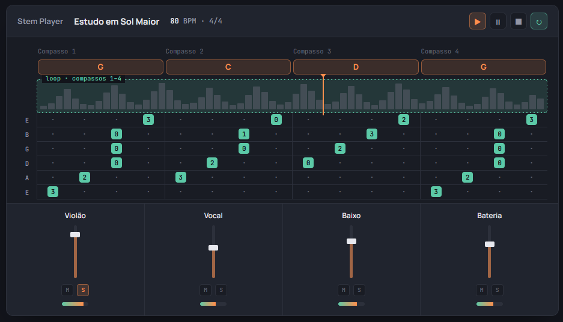
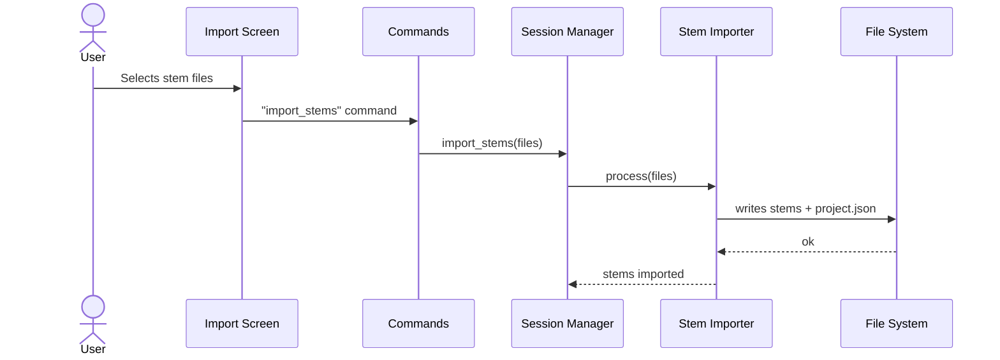
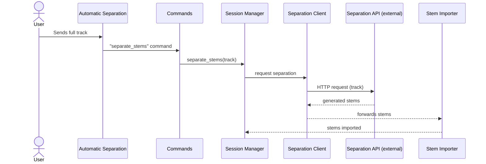
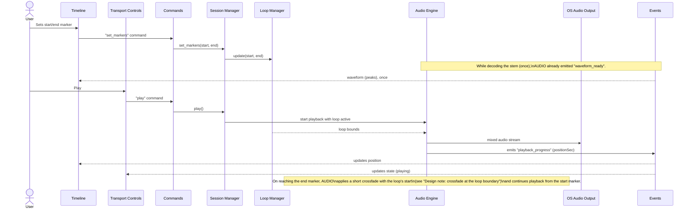
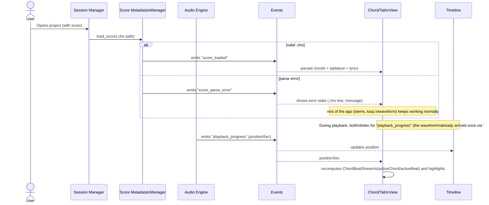

# StemLoft

> **Maintenance note:** this doc has a Brazilian Portuguese sibling at
> [`architecture.pt-BR.md`](./architecture.pt-BR.md). Whenever one is
> updated, update the other in the same change — don't let the two drift
> apart.

Desktop app for playing back musical _stems_, focused on **creating loop repeats of sections using time markers**.

## About

StemLoft is a practice tool for **beginner musicians**. Starting from the stems of a song (isolated tracks for each instrument), the user marks a section on the timeline and the app repeats it continuously — letting them practice their part by playing along with, or in place of, an instrument from the original recording.

The user also controls the mixer for each stem (volume, mute, and solo), for example muting the instrument they're learning and playing over the rest of the track.

## Main feature

**Loop repeats via time markers.** Set a start and end marker on a section of the song and repeat it as many times as needed, at the recording's original tempo, with the other instruments playing normally.

## Stack and platform

The app is built on **Tauri v2**: a logic core in **Rust** (audio, state, persistence) embedded with a presentation layer in **Angular**, running inside Tauri's WebView. Communication between the two layers happens through **Tauri's IPC bridge** (`Commands` and `Events`).

The project keeps Tauri and Angular on the latest stable release at all times — they aren't pinned once and forgotten. This is a deliberate policy, not just a preference for novelty: it reinforces the same goal of minimizing attack surface mentioned above (no third-party packages in Angular) — outdated frameworks accumulate known, unpatched vulnerabilities. Practical consequence: the Rust core must not depend on API details of a specific Tauri version that a future update might remove — the IPC bridge (`Commands`/`Events`) is treated as replaceable, not as a fixed part of the core's design (the same separation that would, in the limit, allow swapping the presentation layer itself).

**Rust is the foundation of the project — all of the app's intelligence lives there, never in the presentation layer.** This applies both to state (the source of truth) and to processing logic (how `Commands` are received, queued, and ordered — see [design note](#design-note-commands-queue-in-the-rust-core)): Angular (in Tauri's WebView) is the current presentation choice, not an assumption baked into the core, and its responsibility is limited to **presenting the state that Rust reports and sending user intent** — never deciding, orchestrating, or holding its own logic. No module on the Rust side should depend on anything specific to Angular or Tauri to make a domain decision. This separation is what keeps the door open, in principle, to replacing the entire presentation layer — for example with Flutter — without touching the core; only the communication bridge (and its IPC implementation) would change, and rewriting the frontend would be limited to presentation/sending intent, never to reimplementing intelligence that already exists in Rust. Any state kept on the presentation side (services + Signals, see below) is a **projection/cache** of what Rust has already decided, synced via `Commands`/`Events` — never a second source of truth that could drift from the core.

The Angular layer deliberately uses only **native framework features** — no third-party (npm) packages beyond what Angular itself already provides. The goal is to minimize supply-chain attack surface (a compromised third-party dependency in the build/runtime chain). This also settles the state-management choice: **Signals**, not NgRx (an external package) nor a "pure RxJS" pattern as the primary state source — Signals is native to Angular, and it's the direction the framework itself has been optimizing toward.

## Architecture overview



## Layers

### Logic Core — Rust

Contains all of the app's domain logic, with no dependency on the graphical interface.

#### Design note: patterns familiar to people coming from TypeScript

Whoever writes the Rust code for this core is coming from TypeScript (Angular/Nest.js), not from a Rust background — the code's organization should reuse those mental patterns instead of introducing "advanced" idiomatic Rust just because it's possible. Two direct parallels, already implicit in the design notes above and worth making explicit:

- **Domain module ≈ Nest.js injectable service.** Each module in the table below (`Stem Importer`, `Audio Engine`, `Loop & Marker Manager`, `Project Persistence`, `Score Metadata Manager`) is a `struct` with public methods and a constructor (`new(...)`) that receives its dependencies explicitly — just like a Nest.js `@Injectable()` receiving dependencies in its constructor, except without a DI container behind it: the "injection" is just passing the needed `Arc<...>` values by hand, once, when assembling `AppState` at app startup.
- **`Session/State Manager` ≈ Nest.js controller.** This is already the rule from the [design note: Session as a thin router](#design-note-session-as-a-thin-router) — a `Command` handler only translates the call and dispatches it to the module that owns that domain, with no logic of its own — exactly the role of a Nest.js controller (receives the request, calls the service, returns the response) instead of a "god object" that accumulates business rules.

Practical consequence: prefer explicit and repetitive (simple structs, clear methods, manual dependency injection) over "smarter" Rust abstractions (heavy generics, macros, excessive trait objects, elaborate lifetimes) when both solve the same problem — the metric for "good code" here is "understandable coming from Angular/Nest.js without learning advanced Rust first," not "idiomatic by Rust community standards." This only gives way if performance is **significantly** affected — the same criterion already used in the [concurrency model decision](#design-note-concurrency-model-for-shared-state): simple by default, complex only when measured and necessary.

| Component | Responsibility |
|---|---|
| **Session/State Manager** | Holds **only** a reference to the currently open project (which project, which stem/`.cho` paths) — contains no domain logic of its own. It's the entry point for `Commands`, but each Command is dispatched to the module that owns that domain (Importer, Audio Engine, Loops, Metadata, Persistence), which performs the operation; the Session only reads/updates the shared state those modules consult. See [design note](#design-note-session-as-a-thin-router). |
| **Stem Importer** | Receives stem files (local or from automatic separation), upmixes mono to stereo when needed, and writes them to the project's file system. |
| **Separation Client** (future) | Adapter that speaks HTTP to the external stem separation API, encapsulating the rest of the core's integration with that service; receives the API's response and forwards the stems to the Importer — nothing else in the core talks HTTP directly to the API. |
| **Loop & Marker Manager** | Holds the start/end marker for the looped section and feeds that information to the audio engine for continuous repetition. |
| **Audio Engine** | Decodes, mixes, and plays back the stems; applies the marked loop and the volume/mute/solo states; pre-computes the waveform once per stem (cached to disk by `Project Persistence`, not recalculated every time the project opens — see [design note](#design-note-waveform-cache-on-disk)); emits progress/transport/waveform events and error events (output device, decoding). See [design note](#design-note-audio-engine-and-the-real-time-thread) on the boundary with the `cpal` real-time thread. |
| **Project Persistence** | Serializes/reads the project's state (stems, markers, mix) as a `.json` file, including the reference to the score metadata `.cho` file and each stem's waveform cache. |
| **Score Metadata Manager** | Parses the `.cho` (ChordPro) file referenced by the project — chords, tablature, lyrics, metronome, and tuning — and exposes the result to the UI via `Events` for display synced with the timeline. |

#### Design note: Session as a thin router

`Session/State Manager` exists to solve one specific problem — "which project is open right now" — not to accumulate logic for every new feature. The practical rule: a new `Command` gets its handler in the module that owns that domain (e.g., `set_markers` only touches the `Loop Manager`); the Session only steps in if the handler needs to know which project is active. If a handler starts coordinating more than one module with its own logic (not just passing data through), that's a sign that logic belongs in a new module — not in the Session. This keeps it from becoming a *god object* as the number of `Commands` grows.

#### Design note: concurrency model for shared state

The state of `Session/State Manager`, `Loop & Marker Manager`, and `Project Persistence` is written by the worker that processes the [`Commands` queue](#design-note-commands-queue-in-the-rust-core) — one `Command` at a time, never two handlers at once, since the queue serializes this before anything touches `AppState`. Even so, `AppState` isn't accessed only by that worker: background tasks (the debounced checkpoint in `Project Persistence`, for instance) can also touch it, and it eventually needs to feed the `cpal` real-time thread. The choice here is deliberately the model that's **simplest to reason about**, not the theoretically fastest: a single `Arc<Mutex<AppState>>` (or a handful of `Mutex`es, one per module — not several per feature) holding this state. Whoever needs to touch it calls `lock()`, reads/changes what's needed, releases the lock — matching the intuition of "only one thing can touch this at a time," with no need to understand channels, actors, or atomic memory ordering to work in the core.

Two things make this simple model viable without becoming a performance hack:

- **The `Commands` queue already serializes the most frequent source of contention** — there are never two `Commands` changing `AppState` at the same time, so the `Mutex` only has to arbitrate `Command` vs. background task, a rare situation. This isn't a server handling thousands of concurrent requests, it's one person clicking buttons; lock contention at this volume is, in practice, unmeasurable.
- **The `cpal` real-time thread never touches this `Mutex`.** This was already a rule before this decision (see [note below](#design-note-audio-engine-and-the-real-time-thread)): the callback only reads atomic variables/double-buffers (volume/mute/solo) and ring buffers already prepared (`rtrb`) — never a lock it might have to wait on. The shared-state `Mutex` and the real-time boundary are two separate mechanisms; a `Command` handler that changes volume, for example, does `lock() → change AppState → release lock → publish the new value to the atomic variable the callback reads` — the `Mutex` is never on the path the audio depends on to avoid stalling.

It's only worth considering something more elaborate (a more granular per-module `Mutex`, channels, or an actor-style design) if profiling shows real, noticeable contention — not as speculative optimization before measuring. For this app's size and usage (one local user, not a multi-tenant server), that's an unlikely scenario.

#### Design note: Audio Engine and the real-time thread

The `cpal` audio callback runs on a real-time thread: nothing that allocates, blocks on a lock, or does I/O may run inside it — a single underrun is already audible as a glitch. This implies a boundary within the `Audio Engine` module itself that the component table doesn't express, since it's a C4-style module diagram, not a thread diagram:

- **Decoding** (reading the stem file, decoding to PCM) happens outside the callback, ahead of time — the result sits in a buffer (ring buffer or similar) already ready to be read.
- **Inside the callback**, only reading from that buffer happens, along with mixing the samples (applying the already-resolved volume/mute/solo) and the crossfade at the loop boundary (see [design note](#design-note-crossfade-at-the-loop-boundary)) — none of these operations decode or read from disk.
- Volume/mute/solo changes made by the UI (via `Command`) write to a shared variable read by the callback (e.g., atomic, or double-buffer) — never a `Mutex` the callback might have to wait on.

This separation is an implementation constraint of the `Audio Engine` module, not a new architectural component — it doesn't change the table or the diagram, only how the code inside the module must be organized.

#### Design note: crossfade at the loop boundary

A hard cut back to the start marker can sound like a click if `endSec`/`startSec` don't land on a zero-crossing — the decision is to avoid that risk with a **short crossfade** (a few ms) instead of a hard cut: in the last instants before `endSec`, the audio that's ending is blended (fade-out) with the audio starting at `startSec` (fade-in), instead of jumping straight from one point to the other.

This is pure math over already-decoded samples (multiply and add), so it fits inside the real-time callback without violating the no-allocate/no-block/no-I/O constraint — but it requires that the **start of the loop already be available** by the time the callback reaches the end of it, not just the sequential section that comes next. Since ahead-of-time decoding normally delivers samples in order (it doesn't jump backward), the `Audio Engine` needs to keep a small separate buffer with the first instants starting at `startSec` (enough to cover the crossfade's duration), prepared outside the callback as soon as the loop is set or restarted — the callback only reads the two buffers (the one ending and this one) and blends them.

The exact crossfade duration and mixing curve (linear vs. equal-power) remain an implementation detail, not a pending architecture decision.

#### Design note: audio crates (cross-platform)

The app's cross-platform target is **Linux, Windows, macOS, and Android** (Tauri v2 covers desktop and mobile). Three responsibilities of the `Audio Engine`, three crates, chosen to prioritize the least possible friction running on all four platforms with no platform-specific code inside the module itself:

- **Decoding**: [`symphonia`](https://github.com/pdeljanov/Symphonia) — a **pure Rust** decoder, with no dependency on a native OS library. This is the main reason for the cross-platform choice: the same code decodes on all four platforms, with no platform-specific port to maintain. It supports WAV, FLAC, OGG/Vorbis, MP3, AAC, ALAC, MP4, and others, each format behind a Cargo feature flag — enable only the formats stem import needs to accept (WAV covers the most common case of already-separated stems; enable MP3/FLAC/AAC if the app accepts those formats directly on import).
- **Buffer between decoding and the real-time callback**: [`rtrb`](https://github.com/mgeier/rtrb) — an SPSC ring buffer (one producer, one consumer) built specifically for this pattern: the decoding thread writes, the `cpal` callback reads, and neither side blocks waiting for data or space (*wait-free*) — exactly the constraint of the [real-time thread](#design-note-audio-engine-and-the-real-time-thread) described above. `ringbuf` is the better-known alternative and would also work, but it serves a more general case (including multi-producer/consumer); for this specific boundary (one decoder, one callback), `rtrb`'s narrower API is easier to use without slipping into a use that violates the real-time constraint.
- **Audio output / device negotiation**: [`cpal`](https://github.com/RustAudio/cpal) — already mentioned in the Local Infrastructure table. Covers all four platforms with a different native backend behind each one (ALSA on Linux, WASAPI on Windows, CoreAudio on macOS, [Oboe](https://github.com/katyo/oboe-rs) on Android) behind the same API — the `Audio Engine` code that calls `cpal` doesn't change between platforms, only the backend it selects at build/run time.

An Android-specific point worth flagging, which doesn't change the crate choice but is integration friction to expect during implementation: `cpal`'s Oboe backend needs a JVM/Android context handle to initialize the audio stream. In a Tauri v2 mobile app, that context comes from Tauri itself on the Android side — the `Audio Engine` can't open the stream on its own without that handle being passed in at initialization; it's a wiring detail between Tauri and `cpal`, not domain logic.

#### Design note: when `Project Persistence` writes

`Stem Mixer` generates `Commands` on every tick of a fader being dragged — writing the project's `.json` on every single one would be wasted I/O and a risk of concurrent/partial writes to the same file. `Project Persistence` doesn't write on every `Command` that changes state: changes mark the project as "dirty," and the disk write happens at checkpoints — an inactivity debounce (e.g., a few milliseconds with no new `Commands`) or definitive events (pausing playback, closing the project). Reading the project stays immediate; only the write is batched.

**Every disk write made by `Project Persistence` is atomic** — no exceptions, not just at the checkpoint above: it writes to a temporary file in the same directory and `rename`s it to the final path (the project's `.json`, waveform cache, and in the future the `.cho` once chord editing lands, after v1 — see [Current status and future work](#current-status-and-future-work)). `rename` is atomic at the file-system level, so the previous file is never left truncated or partially written if the app crashes mid-operation — the worst case is losing the write in progress, never corrupting a file that already existed.

#### Design note: waveform cache on disk

Computing a stem's amplitude peaks requires decoding the entire file — expensive on weak devices, and the app's target is precisely to run well on them (performance on weak hardware is a requirement, not just a nice-to-have). That's why the waveform is **cached to disk**, not recalculated in memory every time the project opens: `Audio Engine` computes the peaks once (on import, or on first open if no cache exists yet) and `Project Persistence` writes the result to a cache file alongside the project (the same atomic write used for any other file it writes); opening the project again reads that cache instead of decoding the stem again.

The cache has to be invalidated if it goes stale: if the stem file is re-imported/replaced, the corresponding cache is discarded and recomputed — otherwise the displayed waveform wouldn't match the actual audio.

### Communication Bridge — Tauri IPC

Interface between the WebView (Angular) and the Rust core.

| Component | Responsibility |
|---|---|
| **Commands (Angular → Rust)** | UI calls into the core: open/create project, import stems, change the mixer, transport (play/pause/stop), set loop markers, trigger automatic separation. |
| **Events (Rust → Angular)** | A **multi-producer** channel: `Audio Engine` publishes playback progress/transport/waveform/error; `Score Metadata Manager` publishes parsed chords/tablature/lyrics. It's not "the audio engine's channel" — it's a notification bus for the core, with more than one source. See the [events table](#events-table) below. |

#### Events table

| Event | Producer | Essential payload | Consumer(s) |
|---|---|---|---|
| `playback_progress` | Audio Engine | current position (seconds) | Timeline, Chord/Tab View |
| `waveform_ready` | Audio Engine | amplitude peaks (waveform) for the stem, read from the disk cache (or computed and cached, the first time) | Timeline |
| `transport_state_changed` | Audio Engine | state (`playing` / `paused` / `stopped`) | Transport Controls |
| `audio_error` | Audio Engine | cause (`device_unavailable`, `decode_failed`, ...) and message | Transport Controls (error state) |
| `score_loaded` | Score Metadata Manager | parsed chords, tablature, and lyrics, plus `tempo`/`time`/`tuning` from the `.cho` header | Chord/Tab View |
| `score_parse_error` | Score Metadata Manager | error message and the `.cho` line where it occurred | Chord/Tab View (error state) |

Every event carries its own origin — the UI never has to guess who published what, it just subscribes to the event type it cares about.

`waveform_ready` is deliberately separate from `playback_progress`: waveform is static data (computed once from the decoded file) while position changes on every playback tick — dispatching the same peaks array on every `playback_progress` would mean repeating, over IPC, data that hasn't changed (the same category of redundancy already avoided in `ChordBeatStream`, see [note below](#real-time-visual-state-angular)). `audio_error` covers failures in the output device or in decoding a stem — without it, only `Score Metadata Manager` had a dedicated error channel (`score_parse_error`), leaving the Audio Engine with no way to report a failure other than simply stopping emitting events.

#### Design note: error presentation (modal)

`audio_error` and `score_parse_error` show up in the UI as a **modal** — not a toast or a persistent banner. It's a dialog the user has to dismiss, carrying the cause and the message the event provides.

The modal is about *presenting* the error, not about halting the core: it doesn't pause or undo anything already running on its own in Rust. This matters in particular for `score_parse_error`, which already had the constraint of not halting the rest of the app (stems, loop, waveform keep working normally even with an invalid `.cho`) — the modal reports the problem, the user dismisses it, and the `Chord/Tab View` sits in an error state while the rest of the screen keeps working; the modal isn't reopened until the next `score_parse_error`.

#### Design note: Commands queue in the Rust core

The `Commands` queue lives in the **Rust core**, not on the Angular side. Angular has only two responsibilities — presenting the state Rust reports, and sending user intent — never queuing, ordering, deduplication, or any other logic over `Commands`; that intelligence lives entirely on the Rust side. It's the same reason [Rust is the source of truth](#stack-and-platform), carried over to how `Commands` are processed, not just to state: it minimizes how much would need to be rewritten if the presentation layer is ever swapped for another framework — a new frontend only needs to know how to fire `Commands` and render `Events`, not reimplement a queue, dedup, or in-flight command tracking.

Flow: Angular fires the `Command` as soon as the user acts — with no waiting before sending, and no queue of its own. The Rust core internally queues incoming `Commands` and processes them in sequence (FIFO); each `Command`'s response (or the corresponding `Event`) only arrives once that specific `Command` has finished being processed in there. The two UX behaviors stay the same, only the guarantee now comes from the core:

- **Per button/action**: the control that fired the `Command` stays disabled from the click until that specific `Command`'s response arrives — preventing a double click from resending the same command. This is the UI reflecting a pending response, not a queue — presentation of state, not logic.
- **Between different actions**: another button can fire its own `Command` without waiting for the first to finish — both reach the core and are processed in sequence there; Angular doesn't need to know about this, it just waits for the response to the `Command` it fired itself.

In practice, the user shouldn't notice the queue — it should drain fast enough to feel like an immediate response. If throughput becomes a perceptible problem (queue building up, noticeably delayed response), that's a signal to optimize the core — not to move the queue to the client side, nor to lock the entire UI while it processes.

Since Rust is the source of truth, a `Command`'s successful response is what confirms the state change — the UI doesn't apply the change optimistically before that. What the user sees reflected immediately is the disabled button (feedback that something is "in progress"), not the new state itself.

### Presentation Layer — Angular (Tauri WebView)

| Component | Responsibility |
|---|---|
| **Stem Mixer** | Volume, mute, and solo controls per stem. |
| **Stem Import Screen** | Flow for selecting/uploading stems into a project. |
| **Automatic Separation** (future) | UI to trigger automatic separation of a track into stems via an external API. |
| **Transport Controls** | Play, pause, and stop, reflecting the state emitted by the audio engine. |
| **Timeline + Waveform** | Waveform visualization, selecting the looped section, and positioning markers. |
| **Chord/Tab View** | Displays chords, tablature, and lyrics from the parsed `.cho`, synced with the playback position on the Timeline. In v1, it's read-only display — editing (rewriting the `.cho` from the UI) is planned for after v1, see [Current status and future work](#current-status-and-future-work). |

### Local Infrastructure

| Component | Responsibility |
|---|---|
| **File System** | Stores the stem files and the project's `.json` (persistence and import write here). |
| **OS Audio Output** | The actual audio output, accessed by the audio engine via [`cpal`](https://github.com/RustAudio/cpal). |

### External Services

| Component | Responsibility |
|---|---|
| **Stem Separation API** (future) | External service, accessed over HTTP by the Separation Client, which receives a full track and returns the separated stems. |

## Consistency across a project's stems

Stems from the same song can come from different exports and aren't guaranteed to be identical in sample rate, channels, or exact duration. Rules resolve this at the boundary where files enter the project, instead of letting the Audio Engine decide this on every playback:

- **Sample rate**: `Stem Importer` validates, at import time, that every stem in a given project shares the same sample rate. A stem with a sample rate different from those already imported is rejected with an explicit error — the app doesn't silently resample.
- **Channels (mono/stereo)**: unlike sample rate, there's no rejection here — every stem is **stereo** within the project. An imported mono stem is upmixed (channel duplicated to L/R) by `Stem Importer` at import time, not on every playback. The difference in treatment compared to sample rate is deliberate: silently resampling would alter the audio in a way the app doesn't want to decide on its own (a quality tradeoff), while duplicating a mono channel into two identical ones is a lossless, unambiguous conversion — there's no "wrong way" to turn mono into stereo. This also keeps `Audio Engine` free from having to deal with mixed mono/stereo: every buffer that reaches the mixing callback is already stereo.
- **Duration**: small duration differences between stems are expected and not an error. `Stem Importer` reads each stem's duration (from the file header, without decoding the whole audio) and writes it to `stems[].durationSec` in the project's `.json` (see [schema](#project-versioning)). The project's duration is that of its longest stem; when mixing, `Audio Engine` treats shorter stems as silence after each one ends.
- **Loop markers**: `set_markers` validates `endSec` against the project's duration (the largest `durationSec` among the stems) — a marker beyond that is rejected, not silently truncated.

Storing `durationSec` at import time also resolves a missing dependency in the diagram: the rule for closing the last chord (below) needs the duration of the longest stem, but nothing linked `Audio Engine` to `Score Metadata Manager`. With duration persisted in the project's `.json`, `Score Metadata Manager` reads `stems[].durationSec` (via `Project Persistence`/Session state) — it doesn't need to decode audio or depend on the Audio Engine.

## Score metadata (chords, tablature, and lyrics)

The project now carries score metadata — chords, tablature, lyrics, metronome, and tuning — persisted as its **own text file**, no longer embedded in the project's `.json`. `Project Persistence` holds the reference to that file; `Score Metadata Manager` parses it.

### Format: extended ChordPro

The chosen format is **[ChordPro](https://www.chordpro.org/)** (the `.cho` extension), an open standard with 30+ years of history for chords + lyrics in plain text. It already solves a good chunk of what we need for free:

| Need | Native ChordPro feature |
|---|---|
| Chord + lyrics together, as simply as possible | `[G]Amazing [C]grace` — bracket before the syllable where the chord enters |
| Exact chord fingering (which fret on each string) | `{define: G base-fret 1 frets 3 2 0 0 0 3}` |
| Instrumental section / free-form tablature | `{start_of_tab}` … `{end_of_tab}` — monospaced block, rendered verbatim |
| Song metadata | `{title}`, `{key}`, `{tempo}`, `{time}`, `{capo}` |

Two custom extensions, designed not to collide with standard syntax:

- **`{tuning: E A D G B E}`** — tuning, lowest string→highest (the same order `{define}` already uses for `frets`, so it's the same convention throughout the file). The screen still draws the highest string on top — that's just a rendering detail, independent of storage order.
- **`{t: m:ss.cc}`** — absolute time anchor (in the style of a synced-lyrics `.lrc` file), at the start of a line, saying at which second of the audio that line (chords+lyrics or tablature) begins. It lives in `{t: ...}` — its own directive — instead of reusing `[00:12.34]`-style brackets the way `.lrc` does, because brackets are already ChordPro's chord syntax; a parser would try to read "00:12.34" as a chord name.

  Exact format: `t := minute ":" second "." hundredth`, where `minute` is 1+ digits with no leading zero required, `second` is always 2 digits (00–59), and `hundredth` is always 2 digits (00–99). `0:00.00`, `1:05.30`, `12:40.00` are valid; `00.5`, `1:5.3` are not (second/hundredth need their 2 digits).

Unknown directives (`{tuning}`, `{t}`) are the format's expected extension mechanism: any ChordPro reader that doesn't recognize them ignores them and still renders the rest of the file correctly — the file stays useful outside of StemLoft.

**Dialect rule: at most one chord per line.** Plain ChordPro allows multiple chords on one line (`[G]Twinkle twinkle [C]little star`) — but `{t:}` only anchors the *start* of the line, so a second chord on the same line would have no way to get its own timestamp. To keep `{t:}` as a reliable sync source, StemLoft requires one chord per line; phrases with a chord change midway become two lines, each with its own `{t:}` anchor (repeating the lyrics if applicable, or leaving the second line with just the chord). `Score Metadata Manager` rejects (with `score_parse_error`) a line with more than one `[chord]`.

Guitar technique notation inside `{start_of_tab}` stays the same as already documented:

| Symbol | Technique | Example | Meaning |
|---|---|---|---|
| `h` | Hammer-on | `5h7` | Play fret 5 and sound fret 7 on the same string, without picking again |
| `p` | Pull-off | `7p5` | Play fret 7 and release to sound fret 5, without picking again |
| `b` | Bend | `7b9` | Bend the string at fret 7 until it sounds like fret 9 |
| `r` | Release | `7b9r7` | A bend followed by releasing back to fret 7 |
| `/` | Slide up | `5/7` | Slide from fret 5 up to fret 7 |
| `\` | Slide down | `7\5` | Slide from fret 7 down to fret 5 |
| `~` | Vibrato | `8~` | Vibrate the note at fret 8 |

#### Grammar

```
item        := note ("-" note)* | "-"        ; "-" alone = rest
note        := fret (op fret | "~")* "." string
op          := "h" | "p" | "b" | "r" | "/" | "\"
fret        := digit digit?                  ; 0-24, no leading zero
string      := "1" | "2" | "3" | "4" | "5" | "6"
digit       := "0".."9"
```

`~` is the only operator with no target fret — it isn't followed by a digit (which is why `8~~b10r8` is valid: `fret=8`, two `~` in a row, then `b` `10` `r` `8`, all before the final `.string`).

Validation rules (the parser should reject or warn):

- `r` is only valid after at least one `b` in the same note — a release with no preceding bend has nothing to release from.
- Two notes in the same `item` (separated by `-`) can't point to the **same string** — physically, a string can only sound one pitch at a time.
- A `fret` outside 0–24 is invalid (the neck's physical limit).
- A `string` outside 1–6 is invalid for 6-string tuning.

#### Resolving `startSec`/`endSec` and the origin of the bar grid

`ActiveChord.startSec` is the value of the `{t:}` on the line where the `[chord]` appears; `endSec` is the `{t:}` of the **next event that changes what's sounding** — that is, the next line that also has a `[chord]`, or the start of the next `{start_of_tab}`. A lyric line with no bracket (a continuation of the same phrase, same chord) does **not** end the current chord — it only advances the displayed text; otherwise, two consecutive lyric lines under the same chord would needlessly cut the highlight in the middle.

Two edge cases need an explicit rule:

- **Last chord in the file:** there's no "next event" — `endSec` is the project's largest `stems[].durationSec` (see [Consistency across stems](#consistency-across-a-projects-stems)), read from the project's `.json`, not decoded on the spot. To close it before that, add a final line with just `{t: ...}` and a `[chord]` marking where the last chord ends (e.g., repeating the same name, just to close the window).
- **Grid origin (bar 1, beat 1):** it's the **first `{t:}` in the file**, not necessarily second 0 of the audio — an intro/count-in before the first anchored line falls outside the bar numbering, and that's fine: `Timeline` keeps showing that section normally, it just has no "bar N" attached until the first anchor.
- **Time inside a `{start_of_tab}`:** the block has a single `{t:}` anchor at its start; each note's position within it is proportional to the character's column on the line — `noteSec = startSec + (column / totalColumns) × (endSec − startSec)`, using the same `endSec` (next event that changes what's sounding) and the tab line's length (all 6 strings have the same number of columns). No anchor is needed per note.

### Full example — chords + lyrics

```
{title: Study in G Major}
{artist: StemLoft - example}
{key: G}
{time: 4/4}
{tempo: 80}
{tuning: E A D G B E}

{define: G base-fret 1 frets 3 2 0 0 0 3}
{define: C base-fret 1 frets x 3 2 0 1 0}
{define: D base-fret 1 frets x x 0 2 3 2}

{t: 0:00.00}
[G]First time I pick up the guitar
{t: 0:03.00}
[C]My fingers still hurt, but I'll keep going
{t: 0:06.00}
[D]Every chord is a step I climb
{t: 0:09.00}
[G]One day I'll play this song without thinking
```

One chord per line, one `{define}` per chord, an original example lyric — this can be typed by hand in any text editor, with no need to understand JSON.

### Example with techniques — instrumental section

```
{title: Phrase with Techniques}
{key: Am}
{time: 4/4}
{tempo: 100}
{tuning: E A D G B E}

{c: Instrumental interlude - A minor pentatonic}
{t: 0:00.00}
{start_of_tab}
E|----------------------------------------------------------------|
B|-5h8-----8p5---------------------------------------------8~-----|
G|-----------------7-----------------------7b9-----7b9r7----------|
D|-------------------------5/7-----7\5----------------------------|
A|----------------------------------------------------------------|
E|----------------------------------------------------------------|
{end_of_tab}
```

`{c: ...}` is ChordPro's standard comment directive — here describing the section for anyone reading/editing the file.

### How this resolves points 1–4 of the analysis

1. **No authoring component** → resolved for v1, not dropped as a feature: it's a plain text file. In v1, the app's boundary is read-only — `Score Metadata Manager` parses the `.cho`, it doesn't write it; the user edits it in any external text editor. Editing chords in the UI itself (the app *rewriting* the `.cho` as the user edits on screen) is a real feature, planned for after v1 — see [Current status and future work](#current-status-and-future-work) — not something forever out of the architecture's scope. Until that feature exists, authoring keeps happening outside the app's boundary (an external text editor today; in the future, also the audio-analysis API, generating that same text, line by line, with no UI needed in the app for a first version of the file to exist).
2. **Rigid beat-indexed grid** → resolved: there's no more array indexed by beat. Chords sit loosely next to the syllable where they enter; tablature is free-form text inside `{start_of_tab}`, with whatever spacing makes sense — no need to fit into N fixed slots.
3. **Unvalidated redundancy** (`sizeInBeats` / `beats` / `tabs.length`) → resolved: none of those fields exist anymore. Duration comes from the actual audio (the stem's length) or from the file's last `{t: ...}`. `{tempo}`/`{time}` still exist only as display metadata (drawing the bar grid), never as the source of truth for position — they stop being "multiple sources of the same truth."
4. **Two time domains with no conversion** → resolved: `{t: m:ss.cc}` uses seconds — the same domain `Loop & Marker Manager` already uses for start/end markers. Chords, lyrics, tablature, and loop now natively share the same unit; BPM becomes just a derived projection for drawing the grid, not the basis for calculation.

### Impact on the architecture

| Component | Before | Now |
|---|---|---|
| **Score Metadata Manager** | Kept a `Project.chords` object in memory | Parses the `.cho` file referenced by the project and exposes the result via `Events` (v1: read-only; writing back to the `.cho` is a future feature, see [Current status and future work](#current-status-and-future-work)) |
| **Project Persistence** | Serialized chords/tabs embedded in the project's `.json` | Writes/reads the project's `.json` with a reference to the `.cho` file (e.g., `"score": "study-in-g-major.cho"`), stored alongside the stems |

Since the `.cho` file is plain text, it's also git-diffable — just like the rest of this documentation.

### Project versioning

The `.cho` doesn't need its own versioning: unknown directives are ignored by any ChordPro reader, so a newer file (with a directive an older app version doesn't yet understand) still opens without breaking — that tolerance is already the compatibility strategy.

The project's `.json` is our own schema, without that native tolerance — it needs explicit versioning. Minimal format:

```json
{
  "schemaVersion": 1,
  "id": "b3a1e6c2-8f21-4d9a-9c3e-1a2b3c4d5e6f",
  "name": "Study in G Major",
  "stems": [
    { "id": "guitar", "file": "guitar.wav", "durationSec": 187.42, "waveformCache": "guitar.waveform" },
    { "id": "vocals", "file": "vocals.wav", "durationSec": 187.42, "waveformCache": "vocals.waveform" },
    { "id": "bass", "file": "bass.wav", "durationSec": 186.90, "waveformCache": "bass.waveform" },
    { "id": "drums", "file": "drums.wav", "durationSec": 187.42, "waveformCache": "drums.waveform" }
  ],
  "score": "study-in-g-major.cho",
  "loop": { "startSec": 0.0, "endSec": 12.0 },
  "mixer": {
    "guitar": { "volume": 0.9, "mute": false, "solo": true },
    "vocals": { "volume": 0.7, "mute": false, "solo": false }
  }
}
```

`score` is optional — a project with no score just plays and loops its stems normally, with no `Chord/Tab View`. `stems` are objects with a stable `id`, not just the file name: `mixer` is indexed by `stems[].id`, so renaming `guitar.wav` doesn't orphan its volume/mute/solo settings — only the `file` field changes. `durationSec` is written by `Stem Importer` at import time (read from the file header, without decoding) and is the source for the project's duration and for closing the last chord — see [Consistency across stems](#consistency-across-a-projects-stems). `waveformCache` is optional (absent until the first time that stem's waveform is computed) and points to the peaks cache file, alongside the stems — see [Design note: waveform cache on disk](#design-note-waveform-cache-on-disk).

`Project Persistence` reads `schemaVersion` before anything else: same version → loads directly; lower version → applies registered migrations in sequence (each one knows how to transform `N` → `N+1`) before exposing the project to the rest of the core; higher version than supported → explicit error ("project saved by a newer version of the app"), never a silent attempt at a partial read.

### What it looks like on screen

Rendering of the same progression on the Timeline + Waveform, with the Chord/Tab View synced below: chords per bar, the active loop region, and the tablature matching each beat.



Interactive mockup (with a fader and fret highlight on hover): [Chords & Tablature](https://claude.ai/code/artifact/af5ed906-86c6-4d45-989e-49065383c682).

### Real-time visual state (Angular)

What the `Chord/Tab View` needs to know what to highlight on screen at every instant — **not** the transport state (play/pause/stop, that's a separate contract) and **not** the whole score (that arrives once, via `score_loaded`). Just the slice that changes on every `playback_progress`: which chord and which beat are currently active.

`score` is optional on the project — the main feature (loop via markers) doesn't depend on a score. With no `.cho` attached, there's no tempo/time-signature formula to compute any beat, so `activeChord` **and** `activeBeat` are nullable; the Chord/Tab screen simply isn't mounted in that case, and this stream is never emitted.

```typescript
/** Fingering diagram for a chord (from the `.cho`'s `{define}`). */
interface ChordDiagram {
  readonly baseFret: number;
  /** From the lowest to the highest string, 6 positions; "x" = muted string. */
  readonly frets: readonly (number | "x")[];
}

/** Chord currently playing, already resolved with absolute timing. */
interface ActiveChord {
  readonly name: string; // "G", "Am7", ...
  readonly startSec: number;
  readonly endSec: number;
  readonly diagram: ChordDiagram | null;
}

/** Current beat within the bar grid. */
interface ActiveBeat {
  readonly bar: number; // bar, 1-based
  readonly beatInBar: number; // 1-based, up to {time}'s numerator (e.g., up to 4 in 4/4)
  readonly startSec: number;
  readonly endSec: number;
}

/**
 * Data stream that updates on every playback tick.
 * `chordProgress`/`beatProgress` are deliberately not included here — they're
 * derivable from `positionSec` + `startSec`/`endSec`, no need for another
 * source of the same truth (see "Unvalidated redundancy" in the analysis).
 */
interface ChordBeatStream {
  readonly positionSec: number;
  readonly activeChord: ActiveChord | null; // null = section with no chord (or no score)
  readonly activeBeat: ActiveBeat | null; // null = no score loaded
}
```

`ChordBeatStream` is recomputed on the Angular side on every `playback_progress` received, cross-referencing `positionSec` with the static score already loaded via `score_loaded` — the Rust core doesn't need to know anything about "which chord is active," it just emits the position. If the project has no `score`, the component never subscribes to `playback_progress` for this purpose, and `ChordBeatStream` doesn't exist.

## Main flows

### Importing stems (manual)



### Automatic separation (future)



### Playback with marker loop



### Synced chord/tablature view



## Current status and future work

- **Currently in development:** Session/State Manager, and by extension the flows it directly orchestrates (manual import, persistence, audio engine, loops/markers, mixer, transport, timeline).
- **Score metadata:** Score Metadata Manager and Chord/Tab View map chords, tablature, lyrics, metronome, and tuning persisted alongside the project (a `.cho` file, optional per project), displayed synced with the timeline — not marked as "future" on the canvas, it ships alongside current development.
- **Planned for the future:** automatic stem separation, both on the UI side ("Automatic Separation") and in the core ("Separation Client") and the external service ("Stem Separation API"), integrating with the existing import flow. The sequence diagram above simplifies the call as a synchronous HTTP request; real separation tends to take minutes, so the implementation will need an asynchronous pattern (a polling or webhook-based job, with its own progress events) instead of a direct request/response call — this document doesn't define that pattern yet because the feature isn't in development.
- **Also planned for the future (out of v1 scope):** editing chords/tablature directly in the `Chord/Tab View`. v1 is read-only — `Score Metadata Manager` parses the `.cho` and never writes it; authoring happens in an external text editor. When that feature lands, the flow partially reverses: the UI edits chords on screen and the core starts *rewriting* the `.cho` (likely with the same atomic-write pattern — write-to-temp-file + rename — already defined for `Project Persistence`, see [design note](#design-note-when-project-persistence-writes)). This document doesn't detail that write flow yet because the feature isn't in development.
