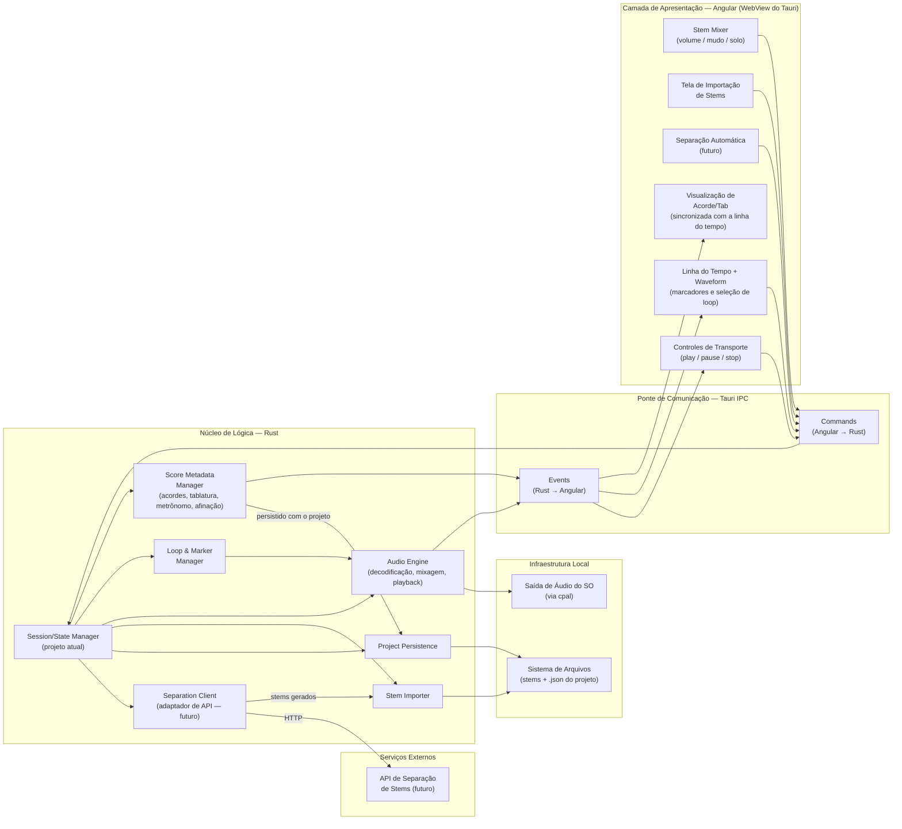
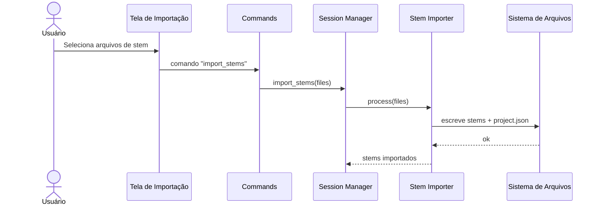
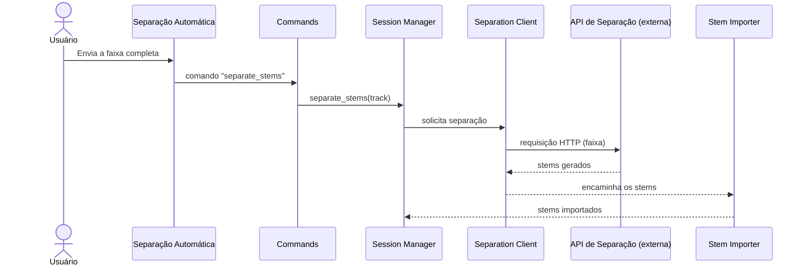
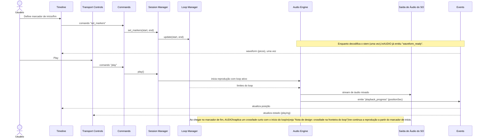
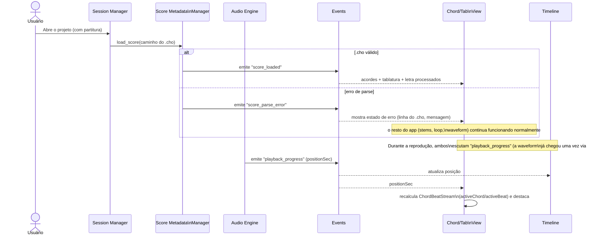

# StemLoft

> **Nota de manutenção:** este documento tem uma versão em inglês em
> [`architecture.md`](./architecture.md). Sempre que um dos dois for
> atualizado, atualize o outro na mesma alteração — não deixe as duas
> versões divergirem.

App desktop para tocar _stems_ musicais, focado em **criar repetições em loop de trechos usando marcadores de tempo**.

## Sobre

StemLoft é uma ferramenta de prática para **músicos iniciantes**. Partindo dos stems de uma música (faixas isoladas de cada instrumento), o usuário marca um trecho na linha do tempo e o app o repete continuamente — permitindo praticar sua parte tocando junto com, ou no lugar de, um instrumento da gravação original.

O usuário também controla o mixer de cada stem (volume, mudo e solo), por exemplo silenciando o instrumento que está aprendendo e tocando sobre o resto da faixa.

## Funcionalidade principal

**Repetição em loop via marcadores de tempo.** Defina um marcador de início e fim em um trecho da música e repita-o quantas vezes forem necessárias, no andamento original da gravação, com os outros instrumentos tocando normalmente.

## Stack e plataforma

O app é construído sobre **Tauri v2**: um núcleo de lógica em **Rust** (áudio, estado, persistência) embutido com uma camada de apresentação em **Angular**, rodando dentro da WebView do Tauri. A comunicação entre as duas camadas acontece através da **ponte de IPC do Tauri** (`Commands` e `Events`).

O projeto mantém Tauri e Angular sempre na última versão estável — eles não ficam fixados de uma vez e esquecidos. Essa é uma política deliberada, não apenas preferência por novidade: ela reforça o mesmo objetivo de minimizar a superfície de ataque mencionado acima (nenhum pacote de terceiros no Angular) — frameworks desatualizados acumulam vulnerabilidades conhecidas e não corrigidas. Consequência prática: o núcleo em Rust não deve depender de detalhes da API de uma versão específica do Tauri que uma atualização futura possa remover — a ponte de IPC (`Commands`/`Events`) é tratada como substituível, não como parte fixa do design do núcleo (a mesma separação que, no limite, permitiria trocar a própria camada de apresentação).

**Rust é a fundação do projeto — toda a inteligência do app mora ali, nunca na camada de apresentação.** Isso vale tanto para o estado (a fonte da verdade) quanto para a lógica de processamento (como os `Commands` são recebidos, enfileirados e ordenados — veja a [nota de design](#nota-de-design-fila-de-commands-no-núcleo-rust)): o Angular (na WebView do Tauri) é a escolha atual de apresentação, não uma premissa embutida no núcleo, e sua responsabilidade se limita a **apresentar o estado que o Rust reporta e enviar a intenção do usuário** — nunca decidir, orquestrar ou manter lógica própria. Nenhum módulo do lado Rust deve depender de algo específico do Angular ou do Tauri para tomar uma decisão de domínio. Essa separação é o que mantém aberta, em princípio, a possibilidade de substituir toda a camada de apresentação — por exemplo por Flutter — sem tocar no núcleo; só a ponte de comunicação (e sua implementação de IPC) mudaria, e reescrever o frontend se limitaria à apresentação/envio de intenção, nunca a reimplementar inteligência que já existe em Rust. Qualquer estado mantido do lado da apresentação (services + Signals, veja abaixo) é uma **projeção/cache** do que o Rust já decidiu, sincronizado via `Commands`/`Events` — nunca uma segunda fonte da verdade que possa divergir do núcleo.

A camada Angular usa deliberadamente apenas **recursos nativos do framework** — nenhum pacote de terceiros (npm) além do que o próprio Angular já oferece. O objetivo é minimizar a superfície de ataque da cadeia de suprimentos (supply chain — uma dependência de terceiros comprometida na cadeia de build/runtime). Isso também define a escolha de gerenciamento de estado: **Signals**, não NgRx (um pacote externo) nem um padrão "RxJS puro" como fonte primária de estado — Signals é nativo do Angular, e é a direção para a qual o próprio framework vem se otimizando.

## Visão geral da arquitetura



## Camadas

### Núcleo de Lógica — Rust

Contém toda a lógica de domínio do app, sem dependência da interface gráfica.

#### Nota de design: padrões familiares para quem vem de TypeScript

Quem escreve o código Rust deste núcleo vem de TypeScript (Angular/Nest.js), não de uma base em Rust — a organização do código deve reaproveitar esses padrões mentais em vez de introduzir Rust "idiomático avançado" só porque é possível. Dois paralelos diretos, já implícitos nas notas de design acima e que vale a pena explicitar:

- **Módulo de domínio ≈ service injetável do Nest.js.** Cada módulo na tabela abaixo (`Stem Importer`, `Audio Engine`, `Loop & Marker Manager`, `Project Persistence`, `Score Metadata Manager`) é uma `struct` com métodos públicos e um construtor (`new(...)`) que recebe suas dependências explicitamente — assim como um `@Injectable()` do Nest.js recebendo dependências no construtor, exceto que sem um container de DI por trás: a "injeção" é apenas passar os valores `Arc<...>` necessários manualmente, uma vez, ao montar o `AppState` na inicialização do app.
- **`Session/State Manager` ≈ controller do Nest.js.** Essa já é a regra da [nota de design: Session como um roteador fino](#nota-de-design-session-como-um-roteador-fino) — um handler de `Command` apenas traduz a chamada e a despacha para o módulo dono daquele domínio, sem lógica própria — exatamente o papel de um controller do Nest.js (recebe a requisição, chama o service, retorna a resposta) em vez de um "god object" que acumula regras de negócio.

Consequência prática: prefira código explícito e repetitivo (structs simples, métodos claros, injeção de dependência manual) a abstrações "mais espertas" de Rust (generics pesados, macros, trait objects em excesso, lifetimes elaborados) quando ambos resolvem o mesmo problema — a métrica de "código bom" aqui é "compreensível vindo de Angular/Nest.js sem precisar aprender Rust avançado antes", não "idiomático pelos padrões da comunidade Rust". Isso só cede se a performance for **significativamente** afetada — o mesmo critério já usado na [decisão do modelo de concorrência](#nota-de-design-modelo-de-concorrência-para-estado-compartilhado): simples por padrão, complexo só quando medido e necessário.

| Componente | Responsabilidade |
|---|---|
| **Session/State Manager** | Mantém **apenas** uma referência ao projeto atualmente aberto (qual projeto, quais caminhos de stem/`.cho`) — não contém lógica de domínio própria. É o ponto de entrada para os `Commands`, mas cada Command é despachado para o módulo dono daquele domínio (Importer, Audio Engine, Loops, Metadata, Persistence), que realiza a operação; a Session apenas lê/atualiza o estado compartilhado que esses módulos consultam. Veja a [nota de design](#nota-de-design-session-como-um-roteador-fino). |
| **Stem Importer** | Recebe arquivos de stem (locais ou de separação automática), faz upmix de mono para estéreo quando necessário, e os grava no sistema de arquivos do projeto. |
| **Separation Client** (futuro) | Adaptador que fala HTTP com a API externa de separação de stems, encapsulando o resto da integração do núcleo com esse serviço; recebe a resposta da API e encaminha os stems para o Importer — nada mais no núcleo fala HTTP diretamente com a API. |
| **Loop & Marker Manager** | Mantém o marcador de início/fim do trecho em loop e alimenta essa informação para o motor de áudio realizar a repetição contínua. |
| **Audio Engine** | Decodifica, mixa e reproduz os stems; aplica o loop marcado e os estados de volume/mudo/solo; pré-computa a waveform uma vez por stem (cacheada em disco por `Project Persistence`, não recalculada toda vez que o projeto abre — veja a [nota de design](#nota-de-design-cache-de-waveform-em-disco)); emite eventos de progresso/transporte/waveform e eventos de erro (dispositivo de saída, decodificação). Veja a [nota de design](#nota-de-design-audio-engine-e-a-thread-de-tempo-real) sobre a fronteira com a thread de tempo real do `cpal`. |
| **Project Persistence** | Serializa/lê o estado do projeto (stems, marcadores, mixagem) como um arquivo `.json`, incluindo a referência ao arquivo `.cho` de metadados de partitura e o cache de waveform de cada stem. |
| **Score Metadata Manager** | Faz o parse do arquivo `.cho` (ChordPro) referenciado pelo projeto — acordes, tablatura, letra, metrônomo e afinação — e expõe o resultado para a UI via `Events` para exibição sincronizada com a linha do tempo. |

#### Nota de design: Session como um roteador fino

O `Session/State Manager` existe para resolver um problema específico — "qual projeto está aberto agora" — não para acumular lógica a cada nova funcionalidade. A regra prática: um novo `Command` ganha seu handler no módulo dono daquele domínio (ex.: `set_markers` só toca o `Loop Manager`); a Session só entra em cena se o handler precisar saber qual projeto está ativo. Se um handler começa a coordenar mais de um módulo com lógica própria (não só repassando dados), isso é sinal de que a lógica pertence a um novo módulo — não à Session. Isso evita que ela vire um *god object* à medida que o número de `Commands` cresce.

#### Nota de design: modelo de concorrência para estado compartilhado

O estado de `Session/State Manager`, `Loop & Marker Manager` e `Project Persistence` é escrito pelo worker que processa a [fila de `Commands`](#nota-de-design-fila-de-commands-no-núcleo-rust) — um `Command` por vez, nunca dois handlers ao mesmo tempo, já que a fila serializa isso antes que qualquer coisa toque o `AppState`. Ainda assim, o `AppState` não é acessado só por esse worker: tarefas em segundo plano (o checkpoint com debounce em `Project Persistence`, por exemplo) também podem tocá-lo, e ele eventualmente precisa alimentar a thread de tempo real do `cpal`. A escolha aqui é deliberadamente o modelo **mais simples de raciocinar sobre**, não o teoricamente mais rápido: um único `Arc<Mutex<AppState>>` (ou alguns poucos `Mutex`es, um por módulo — não vários por funcionalidade) contendo esse estado. Quem precisa tocá-lo chama `lock()`, lê/altera o que for necessário, libera o lock — combinando com a intuição de "só uma coisa pode tocar isso por vez", sem precisar entender channels, actors ou ordenação atômica de memória para trabalhar no núcleo.

Duas coisas tornam esse modelo simples viável sem virar um hack de performance:

- **A fila de `Commands` já serializa a fonte mais frequente de contenção** — nunca há dois `Commands` alterando o `AppState` ao mesmo tempo, então o `Mutex` só precisa arbitrar `Command` vs. tarefa em segundo plano, uma situação rara. Isso não é um servidor lidando com milhares de requisições concorrentes, é uma pessoa clicando botões; a contenção de lock nesse volume é, na prática, imensurável.
- **A thread de tempo real do `cpal` nunca toca esse `Mutex`.** Essa já era uma regra antes dessa decisão (veja a [nota abaixo](#nota-de-design-audio-engine-e-a-thread-de-tempo-real)): o callback só lê variáveis atômicas/double-buffers (volume/mudo/solo) e ring buffers já preparados (`rtrb`) — nunca um lock que possa ter que esperar. O `Mutex` de estado compartilhado e a fronteira de tempo real são dois mecanismos separados; um handler de `Command` que muda o volume, por exemplo, faz `lock() → altera AppState → libera o lock → publica o novo valor na variável atômica que o callback lê` — o `Mutex` nunca está no caminho do qual o áudio depende para evitar travamentos.

Só vale considerar algo mais elaborado (um `Mutex` mais granular por módulo, channels, ou um design estilo actor) se a análise de performance (profiling) mostrar contenção real e perceptível — não como otimização especulativa antes de medir. Para o tamanho e uso deste app (um usuário local, não um servidor multi-tenant), esse é um cenário improvável.

#### Nota de design: Audio Engine e a thread de tempo real

O callback de áudio do `cpal` roda em uma thread de tempo real: nada que aloque, bloqueie em um lock, ou faça I/O pode rodar dentro dele — um único underrun já é audível como uma falha. Isso implica uma fronteira dentro do próprio módulo `Audio Engine` que a tabela de componentes não expressa, já que é um diagrama de módulos estilo C4, não um diagrama de threads:

- **A decodificação** (ler o arquivo do stem, decodificar para PCM) acontece fora do callback, com antecedência — o resultado fica em um buffer (ring buffer ou similar) já pronto para ser lido.
- **Dentro do callback**, só acontece a leitura desse buffer, junto com a mixagem das amostras (aplicando o volume/mudo/solo já resolvido) e o crossfade na fronteira do loop (veja a [nota de design](#nota-de-design-crossfade-na-fronteira-do-loop)) — nenhuma dessas operações decodifica ou lê do disco.
- Mudanças de volume/mudo/solo feitas pela UI (via `Command`) escrevem em uma variável compartilhada lida pelo callback (ex.: atômica, ou double-buffer) — nunca um `Mutex` que o callback possa ter que esperar.

Essa separação é uma restrição de implementação do módulo `Audio Engine`, não um novo componente arquitetural — não muda a tabela nem o diagrama, só como o código dentro do módulo precisa estar organizado.

#### Nota de design: crossfade na fronteira do loop

Um corte seco de volta ao marcador de início pode soar como um clique se `endSec`/`startSec` não caírem em um cruzamento de zero (zero-crossing) — a decisão é evitar esse risco com um **crossfade curto** (alguns ms) em vez de um corte seco: nos últimos instantes antes de `endSec`, o áudio que está terminando é misturado (fade-out) com o áudio que começa em `startSec` (fade-in), em vez de pular diretamente de um ponto para o outro.

Isso é matemática pura sobre amostras já decodificadas (multiplicar e somar), então cabe dentro do callback de tempo real sem violar a restrição de não-alocar/não-bloquear/não-I/O — mas exige que o **início do loop já esteja disponível** no momento em que o callback chega ao fim dele, não apenas o trecho sequencial que vem a seguir. Como a decodificação antecipada normalmente entrega amostras em ordem (não pula para trás), o `Audio Engine` precisa manter um pequeno buffer separado com os primeiros instantes a partir de `startSec` (o suficiente para cobrir a duração do crossfade), preparado fora do callback assim que o loop é definido ou reiniciado — o callback só lê os dois buffers (o que está terminando e este) e os mistura.

A duração exata do crossfade e a curva de mixagem (linear vs. potência constante) permanecem um detalhe de implementação, não uma decisão de arquitetura pendente.

#### Nota de design: crates de áudio (multiplataforma)

O alvo multiplataforma do app é **Linux, Windows, macOS e Android** (Tauri v2 cobre desktop e mobile — veja [Escopo/setup](../TODO.md)). Três responsabilidades do `Audio Engine`, três crates, escolhidas para priorizar o mínimo de atrito possível rodando nas quatro plataformas, sem código específico de plataforma dentro do próprio módulo:

- **Decodificação**: [`symphonia`](https://github.com/pdeljanov/Symphonia) — um decodificador em **Rust puro**, sem dependência de uma biblioteca nativa do SO. Esse é o principal motivo da escolha multiplataforma: o mesmo código decodifica nas quatro plataformas, sem porte específico de plataforma para manter. Suporta WAV, FLAC, OGG/Vorbis, MP3, AAC, ALAC, MP4 e outros, cada formato atrás de uma feature flag do Cargo — habilite só os formatos que a importação de stems precisa aceitar (WAV cobre o caso mais comum de stems já separados; habilite MP3/FLAC/AAC se o app aceitar esses formatos diretamente na importação).
- **Buffer entre a decodificação e o callback de tempo real**: [`rtrb`](https://github.com/mgeier/rtrb) — um ring buffer SPSC (um produtor, um consumidor) construído especificamente para esse padrão: a thread de decodificação escreve, o callback do `cpal` lê, e nenhum dos dois lados bloqueia esperando por dados ou espaço (*wait-free*) — exatamente a restrição da [thread de tempo real](#nota-de-design-audio-engine-e-a-thread-de-tempo-real) descrita acima. `ringbuf` é a alternativa mais conhecida e também funcionaria, mas atende um caso mais geral (incluindo múltiplos produtores/consumidores); para essa fronteira específica (um decodificador, um callback), a API mais estreita do `rtrb` é mais fácil de usar sem escorregar para um uso que viole a restrição de tempo real.
- **Saída de áudio / negociação de dispositivo**: [`cpal`](https://github.com/RustAudio/cpal) — já mencionado na tabela de Infraestrutura Local. Cobre as quatro plataformas com um backend nativo diferente atrás de cada uma (ALSA no Linux, WASAPI no Windows, CoreAudio no macOS, [Oboe](https://github.com/katyo/oboe-rs) no Android) atrás da mesma API — o código do `Audio Engine` que chama o `cpal` não muda entre plataformas, só o backend que ele seleciona em tempo de build/execução.

Um ponto específico do Android que vale sinalizar, que não muda a escolha do crate mas é atrito de integração a esperar durante a implementação: o backend Oboe do `cpal` precisa de um handle de contexto JVM/Android para inicializar o stream de áudio. Em um app mobile Tauri v2, esse contexto vem do próprio Tauri no lado Android — o `Audio Engine` não consegue abrir o stream sozinho sem que esse handle seja passado na inicialização; é um detalhe de conexão entre Tauri e `cpal`, não lógica de domínio.

#### Nota de design: quando `Project Persistence` escreve

O `Stem Mixer` gera `Commands` a cada tick de um fader sendo arrastado — escrever o `.json` do projeto a cada um deles seria I/O desperdiçado e um risco de escritas concorrentes/parciais no mesmo arquivo. O `Project Persistence` não escreve a cada `Command` que muda o estado: as mudanças marcam o projeto como "sujo" ("dirty"), e a escrita em disco acontece em checkpoints — um debounce de inatividade (ex.: alguns milissegundos sem novos `Commands`) ou eventos definitivos (pausar a reprodução, fechar o projeto). A leitura do projeto continua imediata; só a escrita é agrupada.

**Toda escrita em disco feita por `Project Persistence` é atômica** — sem exceções, não só no checkpoint acima: ela escreve em um arquivo temporário no mesmo diretório e faz `rename` para o caminho final (o `.json` do projeto, o cache de waveform e, futuramente, o `.cho` quando a edição de acordes chegar, após a v1 — veja [Status atual e trabalho futuro](#status-atual-e-trabalho-futuro)). `rename` é atômico no nível do sistema de arquivos, então o arquivo anterior nunca fica truncado ou parcialmente escrito se o app travar no meio da operação — o pior caso é perder a escrita em andamento, nunca corromper um arquivo que já existia.

#### Nota de design: cache de waveform em disco

Calcular os picos de amplitude de um stem exige decodificar o arquivo inteiro — caro em dispositivos fracos, e o alvo do app é justamente rodar bem neles (performance em hardware fraco é um requisito, não só um diferencial). Por isso a waveform é **cacheada em disco**, não recalculada em memória toda vez que o projeto abre: o `Audio Engine` calcula os picos uma vez (na importação, ou na primeira abertura se ainda não existir cache) e o `Project Persistence` escreve o resultado em um arquivo de cache ao lado do projeto (a mesma escrita atômica usada para qualquer outro arquivo que ele escreve); abrir o projeto novamente lê esse cache em vez de decodificar o stem de novo.

O cache precisa ser invalidado se ficar desatualizado: se o arquivo do stem for reimportado/substituído, o cache correspondente é descartado e recalculado — caso contrário, a waveform exibida não corresponderia ao áudio real.

### Ponte de Comunicação — Tauri IPC

Interface entre a WebView (Angular) e o núcleo Rust.

| Componente | Responsabilidade |
|---|---|
| **Commands (Angular → Rust)** | Chamadas da UI para o núcleo: abrir/criar projeto, importar stems, alterar o mixer, transporte (play/pause/stop), definir marcadores de loop, disparar separação automática. |
| **Events (Rust → Angular)** | Um canal **multi-produtor**: `Audio Engine` publica progresso de reprodução/transporte/waveform/erro; `Score Metadata Manager` publica acordes/tablatura/letra já processados. Não é "o canal do motor de áudio" — é um barramento de notificações do núcleo, com mais de uma origem. Veja a [tabela de eventos](#tabela-de-eventos) abaixo. |

#### Tabela de eventos

| Evento | Produtor | Payload essencial | Consumidor(es) |
|---|---|---|---|
| `playback_progress` | Audio Engine | posição atual (segundos) | Timeline, Chord/Tab View |
| `waveform_ready` | Audio Engine | picos de amplitude (waveform) do stem, lidos do cache em disco (ou calculados e cacheados, na primeira vez) | Timeline |
| `transport_state_changed` | Audio Engine | estado (`playing` / `paused` / `stopped`) | Transport Controls |
| `audio_error` | Audio Engine | causa (`device_unavailable`, `decode_failed`, ...) e mensagem | Transport Controls (estado de erro) |
| `score_loaded` | Score Metadata Manager | acordes, tablatura e letra processados, além de `tempo`/`time`/`tuning` do cabeçalho do `.cho` | Chord/Tab View |
| `score_parse_error` | Score Metadata Manager | mensagem de erro e a linha do `.cho` onde ocorreu | Chord/Tab View (estado de erro) |

Todo evento carrega sua própria origem — a UI nunca precisa adivinhar quem publicou o quê, só se inscreve no tipo de evento que interessa.

`waveform_ready` é deliberadamente separado de `playback_progress`: a waveform é um dado estático (calculado uma vez a partir do arquivo decodificado) enquanto a posição muda a cada tick de reprodução — despachar o mesmo array de picos a cada `playback_progress` significaria repetir, via IPC, um dado que não mudou (a mesma categoria de redundância já evitada em `ChordBeatStream`, veja a [nota abaixo](#estado-visual-em-tempo-real-angular)). `audio_error` cobre falhas no dispositivo de saída ou na decodificação de um stem — sem ele, só o `Score Metadata Manager` tinha um canal de erro dedicado (`score_parse_error`), deixando o Audio Engine sem forma de reportar uma falha além de simplesmente parar de emitir eventos.

#### Nota de design: apresentação de erro (modal)

`audio_error` e `score_parse_error` aparecem na UI como um **modal** — não um toast ou um banner persistente. É um diálogo que o usuário precisa dispensar, carregando a causa e a mensagem que o evento fornece.

O modal é sobre *apresentar* o erro, não sobre parar o núcleo: ele não pausa nem desfaz nada que já esteja rodando sozinho em Rust. Isso importa em particular para `score_parse_error`, que já tinha a restrição de não travar o resto do app (stems, loop, waveform continuam funcionando normalmente mesmo com um `.cho` inválido) — o modal reporta o problema, o usuário o dispensa, e o `Chord/Tab View` fica em um estado de erro enquanto o resto da tela continua funcionando; o modal não é reaberto até o próximo `score_parse_error`.

#### Nota de design: fila de Commands no núcleo Rust

A fila de `Commands` vive no **núcleo Rust**, não do lado do Angular. O Angular tem apenas duas responsabilidades — apresentar o estado que o Rust reporta, e enviar a intenção do usuário — nunca enfileirar, ordenar, deduplicar, ou qualquer outra lógica sobre `Commands`; essa inteligência mora inteiramente do lado Rust. É o mesmo motivo pelo qual [Rust é a fonte da verdade](#stack-e-plataforma), estendido para como os `Commands` são processados, não só para o estado: minimiza o quanto precisaria ser reescrito se a camada de apresentação algum dia for trocada por outro framework — um novo frontend só precisa saber como disparar `Commands` e renderizar `Events`, não reimplementar uma fila, deduplicação, ou rastreamento de comandos em andamento.

Fluxo: o Angular dispara o `Command` assim que o usuário age — sem esperar antes de enviar, e sem fila própria. O núcleo Rust enfileira internamente os `Commands` recebidos e os processa em sequência (FIFO); a resposta de cada `Command` (ou o `Event` correspondente) só chega quando aquele `Command` específico terminou de ser processado ali dentro. Os dois comportamentos de UX continuam os mesmos, só que agora a garantia vem do núcleo:

- **Por botão/ação**: o controle que disparou o `Command` fica desabilitado desde o clique até a resposta daquele `Command` específico chegar — evitando que um clique duplo reenvie o mesmo comando. Isso é a UI refletindo uma resposta pendente, não uma fila — apresentação de estado, não lógica.
- **Entre ações diferentes**: outro botão pode disparar seu próprio `Command` sem esperar o primeiro terminar — ambos chegam ao núcleo e são processados em sequência ali; o Angular não precisa saber disso, só espera a resposta do `Command` que ele mesmo disparou.

Na prática, o usuário não deve perceber a fila — ela deve esvaziar rápido o suficiente para parecer uma resposta imediata. Se a vazão se tornar um problema perceptível (fila se acumulando, resposta visivelmente atrasada), isso é um sinal para otimizar o núcleo — não para mover a fila para o lado do cliente, nem para travar a UI inteira enquanto processa.

Como o Rust é a fonte da verdade, a resposta de sucesso de um `Command` é o que confirma a mudança de estado — a UI não aplica a mudança de forma otimista antes disso. O que o usuário vê refletido imediatamente é o botão desabilitado (feedback de que algo está "em andamento"), não o novo estado em si.

### Camada de Apresentação — Angular (WebView do Tauri)

| Componente | Responsabilidade |
|---|---|
| **Stem Mixer** | Controles de volume, mudo e solo por stem. |
| **Stem Import Screen** | Fluxo para selecionar/enviar stems para um projeto. |
| **Automatic Separation** (futuro) | UI para disparar a separação automática de uma faixa em stems via uma API externa. |
| **Transport Controls** | Play, pause e stop, refletindo o estado emitido pelo motor de áudio. |
| **Timeline + Waveform** | Visualização da waveform, seleção do trecho em loop e posicionamento de marcadores. |
| **Chord/Tab View** | Exibe acordes, tablatura e letra do `.cho` processado, sincronizados com a posição de reprodução na Timeline. Na v1, é uma exibição somente leitura — a edição (reescrever o `.cho` a partir da UI) está planejada para depois da v1, veja [Status atual e trabalho futuro](#status-atual-e-trabalho-futuro). |

### Infraestrutura Local

| Componente | Responsabilidade |
|---|---|
| **File System** | Armazena os arquivos de stem e o `.json` do projeto (persistência e importação escrevem aqui). |
| **OS Audio Output** | A saída de áudio real, acessada pelo motor de áudio via [`cpal`](https://github.com/RustAudio/cpal). |

### Serviços Externos

| Componente | Responsabilidade |
|---|---|
| **Stem Separation API** (futuro) | Serviço externo, acessado via HTTP pelo Separation Client, que recebe uma faixa completa e retorna os stems separados. |

## Consistência entre os stems de um projeto

Stems da mesma música podem vir de exportações diferentes e não têm garantia de serem idênticos em taxa de amostragem, canais ou duração exata. Regras resolvem isso na fronteira onde os arquivos entram no projeto, em vez de deixar o Audio Engine decidir isso a cada reprodução:

- **Taxa de amostragem**: `Stem Importer` valida, no momento da importação, que todo stem de um dado projeto compartilha a mesma taxa de amostragem. Um stem com taxa de amostragem diferente dos já importados é rejeitado com um erro explícito — o app não faz resample silenciosamente.
- **Canais (mono/estéreo)**: diferente da taxa de amostragem, não há rejeição aqui — todo stem é **estéreo** dentro do projeto. Um stem mono importado sofre upmix (canal duplicado para L/R) pelo `Stem Importer` no momento da importação, não a cada reprodução. A diferença de tratamento em relação à taxa de amostragem é deliberada: fazer resample silenciosamente alteraria o áudio de uma forma que o app não quer decidir sozinho (uma troca de qualidade), enquanto duplicar um canal mono em dois idênticos é uma conversão sem perdas e inequívoca — não existe "jeito errado" de transformar mono em estéreo. Isso também mantém o `Audio Engine` livre de ter que lidar com mono/estéreo misturados: todo buffer que chega ao callback de mixagem já é estéreo.
- **Duração**: pequenas diferenças de duração entre stems são esperadas e não são um erro. O `Stem Importer` lê a duração de cada stem (a partir do cabeçalho do arquivo, sem decodificar o áudio inteiro) e a grava em `stems[].durationSec` no `.json` do projeto (veja o [schema](#versionamento-do-projeto)). A duração do projeto é a do seu stem mais longo; ao mixar, o `Audio Engine` trata stems mais curtos como silêncio depois que cada um termina.
- **Marcadores de loop**: `set_markers` valida `endSec` contra a duração do projeto (o maior `durationSec` entre os stems) — um marcador além disso é rejeitado, não truncado silenciosamente.

Armazenar `durationSec` no momento da importação também resolve uma dependência faltante no diagrama: a regra para fechar o último acorde (abaixo) precisa da duração do stem mais longo, mas nada ligava o `Audio Engine` ao `Score Metadata Manager`. Com a duração persistida no `.json` do projeto, o `Score Metadata Manager` lê `stems[].durationSec` (via `Project Persistence`/estado da Session) — não precisa decodificar áudio nem depender do Audio Engine.

## Metadados de partitura (acordes, tablatura e letra)

O projeto agora carrega metadados de partitura — acordes, tablatura, letra, metrônomo e afinação — persistidos como seu **próprio arquivo de texto**, não mais embutidos no `.json` do projeto. `Project Persistence` mantém a referência a esse arquivo; `Score Metadata Manager` faz o parse dele.

### Formato: ChordPro estendido

O formato escolhido é **[ChordPro](https://www.chordpro.org/)** (a extensão `.cho`), um padrão aberto com mais de 30 anos de história para acordes + letra em texto puro. Ele já resolve boa parte do que precisamos de graça:

| Necessidade | Recurso nativo do ChordPro |
|---|---|
| Acorde + letra juntos, da forma mais simples possível | `[G]Amazing [C]grace` — colchete antes da sílaba onde o acorde entra |
| Digitação exata do acorde (qual casa em cada corda) | `{define: G base-fret 1 frets 3 2 0 0 0 3}` |
| Trecho instrumental / tablatura livre | `{start_of_tab}` … `{end_of_tab}` — bloco monoespaçado, renderizado literalmente |
| Metadados da música | `{title}`, `{key}`, `{tempo}`, `{time}`, `{capo}` |

Duas extensões personalizadas, desenhadas para não colidir com a sintaxe padrão:

- **`{tuning: E A D G B E}`** — afinação, da corda mais grave para a mais aguda (a mesma ordem que `{define}` já usa para `frets`, então é a mesma convenção em todo o arquivo). A tela continua desenhando a corda mais aguda em cima — isso é só um detalhe de renderização, independente da ordem de armazenamento.
- **`{t: m:ss.cc}`** — âncora de tempo absoluto (no estilo de um arquivo `.lrc` de letra sincronizada), no início de uma linha, dizendo em qual segundo do áudio aquela linha (acordes+letra ou tablatura) começa. Ela vive em `{t: ...}` — sua própria diretiva — em vez de reaproveitar colchetes no estilo `[00:12.34]` como o `.lrc` faz, porque colchetes já são a sintaxe de acordes do ChordPro; um parser tentaria ler "00:12.34" como nome de acorde.

  Formato exato: `t := minuto ":" segundo "." centésimo`, onde `minuto` tem 1+ dígitos sem zero à esquerda obrigatório, `segundo` sempre tem 2 dígitos (00–59), e `centésimo` sempre tem 2 dígitos (00–99). `0:00.00`, `1:05.30`, `12:40.00` são válidos; `00.5`, `1:5.3` não são (segundo/centésimo precisam dos seus 2 dígitos).

Diretivas desconhecidas (`{tuning}`, `{t}`) são o mecanismo de extensão esperado do formato: qualquer leitor de ChordPro que não as reconheça as ignora e ainda renderiza o resto do arquivo corretamente — o arquivo continua útil fora do StemLoft.

**Regra do dialeto: no máximo um acorde por linha.** O ChordPro puro permite múltiplos acordes em uma linha (`[G]Twinkle twinkle [C]little star`) — mas `{t:}` só ancora o *início* da linha, então um segundo acorde na mesma linha não teria como ganhar seu próprio timestamp. Para manter `{t:}` como fonte confiável de sincronização, o StemLoft exige um acorde por linha; frases com troca de acorde no meio viram duas linhas, cada uma com sua própria âncora `{t:}` (repetindo a letra se aplicável, ou deixando a segunda linha só com o acorde). O `Score Metadata Manager` rejeita (com `score_parse_error`) uma linha com mais de um `[acorde]`.

A notação de técnicas de violão/guitarra dentro de `{start_of_tab}` continua igual ao já documentado:

| Símbolo | Técnica | Exemplo | Significado |
|---|---|---|---|
| `h` | Hammer-on | `5h7` | Toca a casa 5 e soa a casa 7 na mesma corda, sem tocar de novo |
| `p` | Pull-off | `7p5` | Toca a casa 7 e solta para soar a casa 5, sem tocar de novo |
| `b` | Bend | `7b9` | Faz o bend da corda na casa 7 até soar como a casa 9 |
| `r` | Release | `7b9r7` | Um bend seguido da liberação de volta para a casa 7 |
| `/` | Slide para cima | `5/7` | Desliza da casa 5 até a casa 7 |
| `\` | Slide para baixo | `7\5` | Desliza da casa 7 até a casa 5 |
| `~` | Vibrato | `8~` | Vibra a nota na casa 8 |

#### Gramática

```
item        := note ("-" note)* | "-"        ; "-" sozinho = pausa
note        := fret (op fret | "~")* "." string
op          := "h" | "p" | "b" | "r" | "/" | "\"
fret        := digit digit?                  ; 0-24, sem zero à esquerda
string      := "1" | "2" | "3" | "4" | "5" | "6"
digit       := "0".."9"
```

`~` é o único operador sem casa de destino — não é seguido por um dígito (por isso `8~~b10r8` é válido: `fret=8`, dois `~` seguidos, depois `b` `10` `r` `8`, tudo antes do `.string` final).

Regras de validação (o parser deve rejeitar ou avisar):

- `r` só é válido depois de pelo menos um `b` na mesma nota — um release sem bend anterior não tem de onde liberar.
- Duas notas no mesmo `item` (separadas por `-`) não podem apontar para a **mesma corda** — fisicamente, uma corda só pode soar uma nota por vez.
- Um `fret` fora de 0–24 é inválido (o limite físico do braço).
- Uma `string` fora de 1–6 é inválida para afinação de 6 cordas.

#### Resolvendo `startSec`/`endSec` e a origem da grade de compassos

`ActiveChord.startSec` é o valor do `{t:}` na linha onde o `[acorde]` aparece; `endSec` é o `{t:}` do **próximo evento que muda o que está soando** — ou seja, a próxima linha que também tem um `[acorde]`, ou o início do próximo `{start_of_tab}`. Uma linha de letra sem colchete (continuação da mesma frase, mesmo acorde) **não** encerra o acorde atual — só avança o texto exibido; caso contrário, duas linhas de letra consecutivas sob o mesmo acorde cortariam o destaque no meio sem necessidade.

Dois casos extremos precisam de uma regra explícita:

- **Último acorde do arquivo:** não há "próximo evento" — `endSec` é o maior `stems[].durationSec` do projeto (veja [Consistência entre os stems](#consistência-entre-os-stems-de-um-projeto)), lido do `.json` do projeto, não decodificado na hora. Para fechá-lo antes disso, adicione uma linha final só com `{t: ...}` e um `[acorde]` marcando onde o último acorde termina (ex.: repetindo o mesmo nome, só para fechar a janela).
- **Origem da grade (compasso 1, tempo 1):** é o **primeiro `{t:}` do arquivo**, não necessariamente o segundo 0 do áudio — uma introdução/contagem antes da primeira linha ancorada fica fora da numeração de compassos, e tudo bem: a `Timeline` continua mostrando esse trecho normalmente, só não tem "compasso N" associado até a primeira âncora.
- **Tempo dentro de um `{start_of_tab}`:** o bloco tem uma única âncora `{t:}` no início; a posição de cada nota dentro dele é proporcional à coluna do caractere na linha — `noteSec = startSec + (coluna / totalColunas) × (endSec − startSec)`, usando o mesmo `endSec` (próximo evento que muda o que está soando) e o comprimento da linha de tab (as 6 cordas têm o mesmo número de colunas). Não é preciso uma âncora por nota.

### Exemplo completo — acordes + letra

```
{title: Study in G Major}
{artist: StemLoft - example}
{key: G}
{time: 4/4}
{tempo: 80}
{tuning: E A D G B E}

{define: G base-fret 1 frets 3 2 0 0 0 3}
{define: C base-fret 1 frets x 3 2 0 1 0}
{define: D base-fret 1 frets x x 0 2 3 2}

{t: 0:00.00}
[G]First time I pick up the guitar
{t: 0:03.00}
[C]My fingers still hurt, but I'll keep going
{t: 0:06.00}
[D]Every chord is a step I climb
{t: 0:09.00}
[G]One day I'll play this song without thinking
```

Um acorde por linha, um `{define}` por acorde, um exemplo original de letra — isso pode ser digitado à mão em qualquer editor de texto, sem precisar entender JSON.

### Exemplo com técnicas — trecho instrumental

```
{title: Phrase with Techniques}
{key: Am}
{time: 4/4}
{tempo: 100}
{tuning: E A D G B E}

{c: Instrumental interlude - A minor pentatonic}
{t: 0:00.00}
{start_of_tab}
E|----------------------------------------------------------------|
B|-5h8-----8p5---------------------------------------------8~-----|
G|-----------------7-----------------------7b9-----7b9r7----------|
D|-------------------------5/7-----7\5----------------------------|
A|----------------------------------------------------------------|
E|----------------------------------------------------------------|
{end_of_tab}
```

`{c: ...}` é a diretiva padrão de comentário do ChordPro — aqui descrevendo o trecho para quem for ler/editar o arquivo.

### Como isso resolve os pontos 1–4 da análise

1. **Nenhum componente de autoria** → resolvido para a v1, não descartado como funcionalidade: é um arquivo de texto puro. Na v1, a fronteira do app é somente leitura — `Score Metadata Manager` faz o parse do `.cho`, não o escreve; o usuário o edita em qualquer editor de texto externo. Editar acordes na própria UI (o app *reescrevendo* o `.cho` conforme o usuário edita na tela) é uma funcionalidade real, planejada para depois da v1 — veja [Status atual e trabalho futuro](#status-atual-e-trabalho-futuro) — não algo para sempre fora do escopo da arquitetura. Até essa funcionalidade existir, a autoria continua acontecendo fora da fronteira do app (um editor de texto externo hoje; no futuro, também a API de análise de áudio, gerando esse mesmo texto, linha a linha, sem necessidade de UI no app para que uma primeira versão do arquivo exista).
2. **Grade rígida indexada por tempo (beat)** → resolvido: não existe mais um array indexado por beat. Os acordes ficam soltos ao lado da sílaba onde entram; a tablatura é texto livre dentro de `{start_of_tab}`, com o espaçamento que fizer sentido — sem precisar caber em N slots fixos.
3. **Redundância não validada** (`sizeInBeats` / `beats` / `tabs.length`) → resolvido: nenhum desses campos existe mais. A duração vem do áudio real (a duração do stem) ou do último `{t: ...}` do arquivo. `{tempo}`/`{time}` continuam existindo só como metadado de exibição (desenhar a grade de compassos), nunca como fonte da verdade para posição — deixam de ser "múltiplas fontes da mesma verdade".
4. **Dois domínios de tempo sem conversão** → resolvido: `{t: m:ss.cc}` usa segundos — o mesmo domínio que o `Loop & Marker Manager` já usa para os marcadores de início/fim. Acordes, letra, tablatura e loop agora compartilham nativamente a mesma unidade; BPM se torna apenas uma projeção derivada para desenhar a grade, não a base do cálculo.

### Impacto na arquitetura

| Componente | Antes | Agora |
|---|---|---|
| **Score Metadata Manager** | Mantinha um objeto `Project.chords` em memória | Faz o parse do arquivo `.cho` referenciado pelo projeto e expõe o resultado via `Events` (v1: somente leitura; escrever de volta no `.cho` é uma funcionalidade futura, veja [Status atual e trabalho futuro](#status-atual-e-trabalho-futuro)) |
| **Project Persistence** | Serializava acordes/tabs embutidos no `.json` do projeto | Escreve/lê o `.json` do projeto com uma referência ao arquivo `.cho` (ex.: `"score": "study-in-g-major.cho"`), armazenado junto com os stems |

Como o arquivo `.cho` é texto puro, ele também é diffável no git — assim como o resto desta documentação.

### Versionamento do projeto

O `.cho` não precisa de versionamento próprio: diretivas desconhecidas são ignoradas por qualquer leitor de ChordPro, então um arquivo mais novo (com uma diretiva que uma versão mais antiga do app ainda não entende) continua abrindo sem quebrar — essa tolerância já é a estratégia de compatibilidade.

O `.json` do projeto é nosso próprio schema, sem essa tolerância nativa — precisa de versionamento explícito. Formato mínimo:

```json
{
  "schemaVersion": 1,
  "id": "b3a1e6c2-8f21-4d9a-9c3e-1a2b3c4d5e6f",
  "name": "Study in G Major",
  "stems": [
    { "id": "guitar", "file": "guitar.wav", "durationSec": 187.42, "waveformCache": "guitar.waveform" },
    { "id": "vocals", "file": "vocals.wav", "durationSec": 187.42, "waveformCache": "vocals.waveform" },
    { "id": "bass", "file": "bass.wav", "durationSec": 186.90, "waveformCache": "bass.waveform" },
    { "id": "drums", "file": "drums.wav", "durationSec": 187.42, "waveformCache": "drums.waveform" }
  ],
  "score": "study-in-g-major.cho",
  "loop": { "startSec": 0.0, "endSec": 12.0 },
  "mixer": {
    "guitar": { "volume": 0.9, "mute": false, "solo": true },
    "vocals": { "volume": 0.7, "mute": false, "solo": false }
  }
}
```

`score` é opcional — um projeto sem partitura simplesmente toca e repete seus stems normalmente, sem `Chord/Tab View`. Os `stems` são objetos com um `id` estável, não só o nome do arquivo: `mixer` é indexado por `stems[].id`, então renomear `guitar.wav` não deixa suas configurações de volume/mudo/solo órfãs — só o campo `file` muda. `durationSec` é escrito pelo `Stem Importer` no momento da importação (lido do cabeçalho do arquivo, sem decodificar) e é a fonte da duração do projeto e para fechar o último acorde — veja [Consistência entre os stems](#consistência-entre-os-stems-de-um-projeto). `waveformCache` é opcional (ausente até a primeira vez que a waveform daquele stem for calculada) e aponta para o arquivo de cache de picos, junto com os stems — veja a [Nota de design: cache de waveform em disco](#nota-de-design-cache-de-waveform-em-disco).

`Project Persistence` lê `schemaVersion` antes de qualquer outra coisa: mesma versão → carrega diretamente; versão menor → aplica as migrações registradas em sequência (cada uma sabe transformar `N` → `N+1`) antes de expor o projeto ao resto do núcleo; versão maior que a suportada → erro explícito ("projeto salvo por uma versão mais nova do app"), nunca uma tentativa silenciosa de leitura parcial.

### Como aparece na tela

Renderização da mesma progressão na Timeline + Waveform, com a Chord/Tab View sincronizada abaixo: acordes por compasso, a região de loop ativa, e a tablatura alinhada a cada tempo (beat).


Mockup interativo (com um fader e destaque de casa ao passar o mouse): [Chords & Tablature](https://claude.ai/code/artifact/af5ed906-86c6-4d45-989e-49065383c682).

### Estado visual em tempo real (Angular)

O que a `Chord/Tab View` precisa saber para destacar na tela a cada instante — **não** o estado de transporte (play/pause/stop, isso é um contrato separado) e **não** a partitura inteira (isso chega uma vez, via `score_loaded`). Só o recorte que muda a cada `playback_progress`: qual acorde e qual tempo (beat) estão ativos no momento.

`score` é opcional no projeto — a funcionalidade principal (loop via marcadores) não depende de uma partitura. Sem um `.cho` anexado, não há fórmula de tempo/fórmula de compasso para calcular nenhum beat, então `activeChord` **e** `activeBeat` são anuláveis; a tela de Chord/Tab simplesmente não é montada nesse caso, e esse stream nunca é emitido.

```typescript
/** Diagrama de digitação de um acorde (do `{define}` do `.cho`). */
interface ChordDiagram {
  readonly baseFret: number;
  /** Da corda mais grave para a mais aguda, 6 posições; "x" = corda silenciada. */
  readonly frets: readonly (number | "x")[];
}

/** Acorde tocando no momento, já resolvido com tempo absoluto. */
interface ActiveChord {
  readonly name: string; // "G", "Am7", ...
  readonly startSec: number;
  readonly endSec: number;
  readonly diagram: ChordDiagram | null;
}

/** Tempo (beat) atual dentro da grade de compassos. */
interface ActiveBeat {
  readonly bar: number; // compasso, começando em 1
  readonly beatInBar: number; // começando em 1, até o numerador de {time} (ex.: até 4 em 4/4)
  readonly startSec: number;
  readonly endSec: number;
}

/**
 * Stream de dados que atualiza a cada tick de reprodução.
 * `chordProgress`/`beatProgress` deliberadamente não estão aqui — são
 * deriváveis de `positionSec` + `startSec`/`endSec`, sem necessidade de
 * outra fonte da mesma verdade (veja "Redundância não validada" na análise).
 */
interface ChordBeatStream {
  readonly positionSec: number;
  readonly activeChord: ActiveChord | null; // null = trecho sem acorde (ou sem partitura)
  readonly activeBeat: ActiveBeat | null; // null = nenhuma partitura carregada
}
```

`ChordBeatStream` é recalculado do lado Angular a cada `playback_progress` recebido, cruzando `positionSec` com a partitura estática já carregada via `score_loaded` — o núcleo Rust não precisa saber nada sobre "qual acorde está ativo", só emite a posição. Se o projeto não tem `score`, o componente nunca se inscreve em `playback_progress` para esse fim, e `ChordBeatStream` não existe.

## Fluxos principais

### Importando stems (manual)



### Separação automática (futuro)



### Reprodução com loop de marcadores



### Visualização sincronizada de acordes/tablatura



## Status atual e trabalho futuro

- **Atualmente em desenvolvimento:** Session/State Manager, e por extensão os fluxos que ele orquestra diretamente (importação manual, persistência, motor de áudio, loops/marcadores, mixer, transporte, timeline).
- **Metadados de partitura:** Score Metadata Manager e Chord/Tab View mapeiam acordes, tablatura, letra, metrônomo e afinação persistidos junto com o projeto (um arquivo `.cho`, opcional por projeto), exibidos sincronizados com a linha do tempo — não marcado como "futuro" no canvas, é entregue junto com o desenvolvimento atual.
- **Planejado para o futuro:** separação automática de stems, tanto do lado da UI ("Automatic Separation") quanto no núcleo ("Separation Client") e no serviço externo ("Stem Separation API"), integrando com o fluxo de importação existente. O diagrama de sequência acima simplifica a chamada como uma requisição HTTP síncrona; a separação de verdade tende a levar minutos, então a implementação vai precisar de um padrão assíncrono (um job baseado em polling ou webhook, com seus próprios eventos de progresso) em vez de uma chamada direta de requisição/resposta — este documento ainda não define esse padrão porque a funcionalidade não está em desenvolvimento.
- **Também planejado para o futuro (fora do escopo da v1):** editar acordes/tablatura diretamente na `Chord/Tab View`. A v1 é somente leitura — `Score Metadata Manager` faz o parse do `.cho` e nunca o escreve; a autoria acontece em um editor de texto externo. Quando essa funcionalidade chegar, o fluxo se inverte parcialmente: a UI edita acordes na tela e o núcleo passa a *reescrever* o `.cho` (provavelmente com o mesmo padrão de escrita atômica — escrever em arquivo temporário + rename — já definido para `Project Persistence`, veja o [TODO](../TODO.md)). Este documento ainda não detalha esse fluxo de escrita porque a funcionalidade não está em desenvolvimento.
