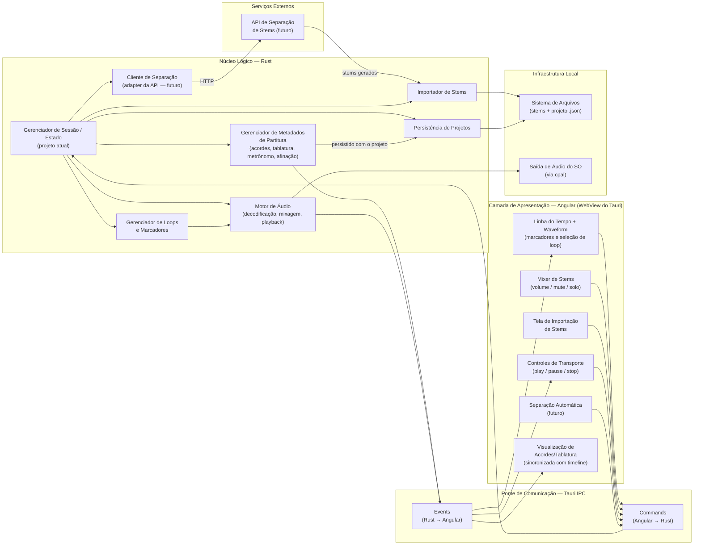
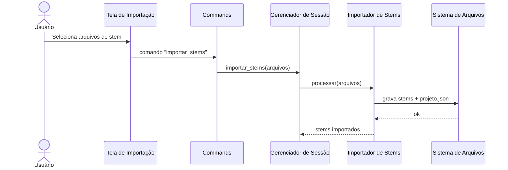
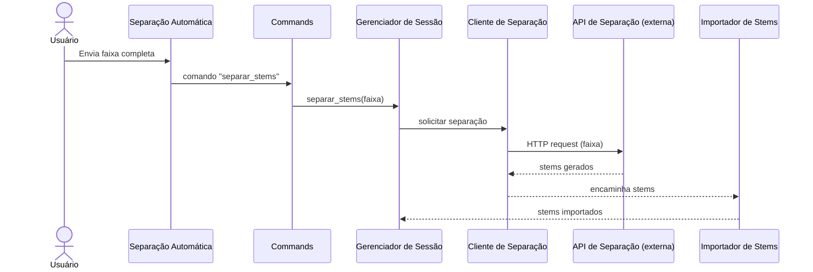
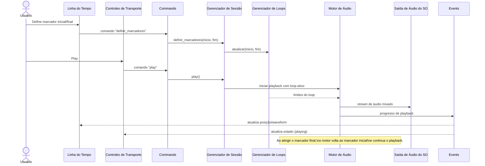
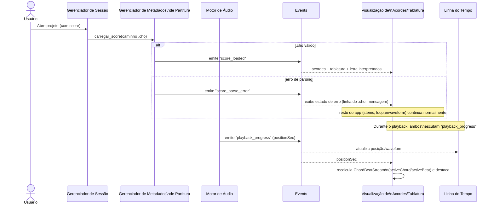

# Stem Player

Aplicativo desktop para reprodução de _stems_ musicais com foco em **criar loops de repetição de trechos por meio de marcadores temporais**.

## Sobre

Stem Player é uma ferramenta de estudo para **músicos iniciantes**. A partir dos stems de uma música (faixas isoladas de cada instrumento), o usuário marca um trecho na linha do tempo e o app o repete continuamente — permitindo praticar a sua parte tocando junto, ou no lugar de, um instrumento da gravação original.

O usuário também controla o mixer de cada stem (volume, mute e solo), podendo, por exemplo, silenciar o instrumento que está aprendendo e tocar por cima.

## Funcionalidade principal

**Loops de repetição por marcadores temporais.** Defina um marcador inicial e um final em um trecho da música e repita-o quantas vezes precisar, no andamento da gravação, com os demais instrumentos soando normalmente.

## Stack e plataforma

O aplicativo é construído sobre **Tauri**: um núcleo lógico em **Rust** (áudio, estado, persistência) embarcado com uma camada de apresentação em **Angular**, rodando dentro da WebView do Tauri. A comunicação entre as duas camadas acontece pela **ponte de IPC do Tauri** (`Commands` e `Events`).

## Visão geral da arquitetura



## Camadas

### Núcleo Lógico — Rust

Contém toda a lógica de domínio do aplicativo, sem dependência da interface gráfica.

| Componente | Responsabilidade |
|---|---|
| **Gerenciador de Sessão / Estado** | Guarda **apenas** a referência ao projeto atualmente aberto (qual projeto, quais caminhos de stems/`.cho`) — não contém lógica de domínio própria. É o ponto de entrada dos `Commands`, mas cada Command é despachado para o módulo dono do domínio (Importador, Motor de Áudio, Loops, Metadados, Persistência), que executa a operação; a Sessão só lê/atualiza o estado compartilhado que esses módulos consultam. Ver [nota de design](#nota-de-design-sessão-como-roteador-fino). |
| **Importador de Stems** | Recebe arquivos de stem (locais ou vindos da separação automática) e os grava no sistema de arquivos do projeto. |
| **Cliente de Separação** (futuro) | Adapter que fala HTTP com a API externa de separação de stems, encapsulando a integração do restante do núcleo com esse serviço. |
| **Gerenciador de Loops e Marcadores** | Mantém marcador inicial/final do trecho em loop e alimenta o motor de áudio com essa informação para repetição contínua. |
| **Motor de Áudio** | Decodifica, mixa e reproduz os stems; aplica o loop marcado e os estados de volume/mute/solo; emite eventos de progresso/transporte. |
| **Persistência de Projetos** | Serializa/lê o estado do projeto (stems, marcadores, mixagem) como arquivo `.json`, incluindo a referência ao arquivo `.cho` de metadados de partitura. |
| **Gerenciador de Metadados de Partitura** | Faz o parsing do arquivo `.cho` (ChordPro) referenciado pelo projeto — acordes, tablatura, letra, metrônomo e afinação — e expõe o resultado à UI via `Events` para exibição sincronizada com a timeline. |

#### Nota de design: Sessão como roteador fino

`Gerenciador de Sessão / Estado` existe pra resolver um problema específico — "qual projeto está aberto agora" — não pra acumular lógica de cada feature nova. A regra prática: um `Command` novo ganha seu handler no módulo dono do domínio (ex.: `definir_marcadores` mexe só no `Gerenciador de Loops`); a Sessão só entra se o handler precisar saber qual projeto está ativo. Se um handler começar a coordenar mais de um módulo com lógica própria (não só repassar dados), é sinal de que essa lógica pertence a um módulo novo — não à Sessão. Isso evita que ela vire um *god object* conforme o número de `Commands` cresce.

### Ponte de Comunicação — Tauri IPC

Interface entre a WebView (Angular) e o núcleo Rust.

| Componente | Responsabilidade |
|---|---|
| **Commands (Angular → Rust)** | Chamadas da UI para o núcleo: abrir/criar projeto, importar stems, alterar mixer, transporte (play/pause/stop), definir marcadores de loop, disparar separação automática. |
| **Events (Rust → Angular)** | Canal **multi-produtor**: `Motor de Áudio` publica progresso de playback/transporte; `Gerenciador de Metadados de Partitura` publica acordes/tablatura/letra interpretados. Não é "o canal do motor de áudio" — é um barramento de notificações do núcleo, com mais de uma origem. Ver [tabela de eventos](#tabela-de-eventos) abaixo. |

#### Tabela de eventos

| Evento | Produtor | Payload essencial | Consumidor(es) |
|---|---|---|---|
| `playback_progress` | Motor de Áudio | posição atual (segundos), amostra de waveform | Linha do Tempo, Visualização de Acordes/Tablatura |
| `transport_state_changed` | Motor de Áudio | estado (`playing` / `paused` / `stopped`) | Controles de Transporte |
| `score_loaded` | Gerenciador de Metadados de Partitura | acordes, tablatura e letra interpretados, mais `tempo`/`time`/`tuning` do cabeçalho do `.cho` | Visualização de Acordes/Tablatura |
| `score_parse_error` | Gerenciador de Metadados de Partitura | mensagem de erro e linha do `.cho` onde ocorreu | Visualização de Acordes/Tablatura (estado de erro) |

Cada evento carrega sua própria origem — a UI nunca precisa adivinhar quem publicou o quê, só assinar o tipo de evento que interessa.

### Camada de Apresentação — Angular (WebView do Tauri)

| Componente | Responsabilidade |
|---|---|
| **Mixer de Stems** | Controles de volume, mute e solo por stem. |
| **Tela de Importação de Stems** | Fluxo de seleção/upload de stems para um projeto. |
| **Separação Automática** (futuro) | UI para disparar a separação automática de uma faixa em stems via API externa. |
| **Controles de Transporte** | Play, pause e stop, refletindo o estado emitido pelo motor de áudio. |
| **Linha do Tempo + Waveform** | Visualização da forma de onda, seleção do trecho em loop e posicionamento dos marcadores. |
| **Visualização de Acordes/Tablatura** | Exibe acordes, tablatura e letra a partir do `.cho` interpretado, sincronizados com a posição de reprodução na Linha do Tempo. |

### Infraestrutura Local

| Componente | Responsabilidade |
|---|---|
| **Sistema de Arquivos** | Armazena os arquivos de stem e o `.json` do projeto (persistência e importação escrevem aqui). |
| **Saída de Áudio do SO** | Saída real de áudio, acessada pelo motor de áudio via [`cpal`](https://github.com/RustAudio/cpal). |

### Serviços Externos

| Componente | Responsabilidade |
|---|---|
| **API de Separação de Stems** (futuro) | Serviço externo, acessado via HTTP pelo Cliente de Separação, que recebe uma faixa completa e devolve os stems separados. |

## Metadados de partitura (acordes, tablatura e letra)

O projeto passa a carregar metadados de partitura — acordes, tablatura, letra, metrônomo e afinação — persistidos como **arquivo de texto próprio**, não mais embutidos no `.json` do projeto. `Persistência de Projetos` guarda a referência a esse arquivo; `Gerenciador de Metadados de Partitura` faz o parsing dele.

### Formato: ChordPro estendido

O formato escolhido é o **[ChordPro](https://www.chordpro.org/)** (extensão `.cho`), um padrão aberto de 30+ anos para cifra + letra em texto puro. Ele já resolve boa parte do que a gente precisa de graça:

| Necessidade | Recurso nativo do ChordPro |
|---|---|
| Acorde + letra juntos, do jeito mais simples possível | `[G]Amazing [C]grace` — colchete antes da sílaba onde o acorde entra |
| Digitação exata do acorde (qual traste em cada corda) | `{define: G base-fret 1 frets 3 2 0 0 0 3}` |
| Trecho instrumental / tablatura livre | `{start_of_tab}` … `{end_of_tab}` — bloco monoespaçado, renderizado verbatim |
| Metadados da música | `{title}`, `{key}`, `{tempo}`, `{time}`, `{capo}` |

Duas extensões próprias, pensadas pra não colidir com a sintaxe padrão:

- **`{tuning: E A D G B E}`** — afinação, corda grave→aguda (mesma ordem que `{define}` já usa para `frets`, então é a mesma convenção em todo o arquivo). A tela ainda desenha a corda aguda em cima — isso é só um detalhe de renderização, independe da ordem de armazenamento.
- **`{t: m:ss.cc}`** — âncora de tempo absoluto (estilo arquivo `.lrc` de letra sincronizada), no início de uma linha, dizendo em que segundo do áudio aquela linha (cifra+letra ou tablatura) começa. Fica em `{t: ...}` — uma diretiva própria — em vez de reaproveitar colchetes `[00:12.34]` como o `.lrc` faz, porque colchetes já são a sintaxe de acorde do ChordPro; um parser tentaria ler "00:12.34" como nome de acorde.

  Formato exato: `t := minuto ":" segundo "." centesimo`, onde `minuto` é 1+ dígitos sem zero à esquerda obrigatório, `segundo` é sempre 2 dígitos (00–59) e `centesimo` é sempre 2 dígitos (00–99). `0:00.00`, `1:05.30`, `12:40.00` são válidos; `00.5`, `1:5.3` não são (segundo/centésimo precisam dos 2 dígitos).

Diretivas desconhecidas (`{tuning}`, `{t}`) são o mecanismo de extensão esperado do formato: qualquer leitor de ChordPro que não as reconheça as ignora e ainda renderiza o resto do arquivo corretamente — o arquivo continua útil fora do Stem Player.

**Regra do dialeto: no máximo um acorde por linha.** ChordPro puro permite vários acordes numa linha (`[G]Twinkle twinkle [C]little star`) — mas `{t:}` só ancora o *início* da linha, então um segundo acorde na mesma linha não teria como ter seu próprio horário. Pra manter `{t:}` como fonte confiável de sincronização, o Stem Player exige um acorde por linha; frases com troca de acorde no meio viram duas linhas, cada uma com sua própria âncora `{t:}` (repetindo a letra se for o caso, ou deixando a segunda linha só com o acorde). `Gerenciador de Metadados de Partitura` rejeita (com `score_parse_error`) uma linha com mais de um `[acorde]`.

A notação de técnicas de guitarra dentro de `{start_of_tab}` continua a mesma já documentada:

| Símbolo | Técnica | Exemplo | Significado |
|---|---|---|---|
| `h` | Hammer-on | `5h7` | Toca o traste 5 e soa o 7 na mesma corda, sem repicar |
| `p` | Pull-off | `7p5` | Toca o traste 7 e solta para soar o 5, sem repicar |
| `b` | Bend | `7b9` | Puxa a corda no traste 7 até soar como o traste 9 |
| `r` | Release | `7b9r7` | Bend seguido da liberação de volta ao traste 7 |
| `/` | Slide ascendente | `5/7` | Desliza do traste 5 até o 7 |
| `\` | Slide descendente | `7\5` | Desliza do traste 7 até o 5 |
| `~` | Vibrato | `8~` | Vibra a nota no traste 8 |

#### Gramática

```
item        := nota ("-" nota)* | "-"        ; "-" sozinho = descanso
nota        := traste (op traste | "~")* "." corda
op          := "h" | "p" | "b" | "r" | "/" | "\"
traste      := digito digito?                ; 0-24, sem zero à esquerda
corda       := "1" | "2" | "3" | "4" | "5" | "6"
digito      := "0".."9"
```

`~` é o único operador sem traste-alvo — não é seguido de dígito (por isso `8~~b10r8` é válido: `traste=8`, dois `~` em sequência, depois `b` `10` `r` `8`, tudo antes do `.corda` final).

Regras de validação (o parser deve rejeitar ou avisar):

- `r` só é válido depois de pelo menos um `b` na mesma nota — um release sem bend anterior não tem o que soltar.
- Duas notas do mesmo `item` (separadas por `-`) não podem apontar para a **mesma corda** — fisicamente uma corda só soa uma altura por vez.
- `traste` fora de 0–24 é inválido (limite físico do braço).
- `corda` fora de 1–6 é inválido pra afinação de 6 cordas.

#### Resolução de `startSec`/`endSec` e origem da grade de compasso

`ActiveChord.startSec` é o valor do `{t:}` da linha onde o `[acorde]` aparece; `endSec` é o `{t:}` do **próximo evento que muda o que está soando** — ou seja, a próxima linha que também tem um `[acorde]`, ou o início do próximo `{start_of_tab}`. Uma linha de letra sem colchete (continuação da mesma frase, mesmo acorde) **não** encerra o acorde atual — só avança o texto exibido; senão, duas linhas de letra seguidas sob o mesmo acorde cortariam o destaque no meio à toa.

Duas bordas precisam de regra explícita:

- **Último acorde do arquivo:** não existe "próximo evento" — o `endSec` é a duração do stem mais longo do projeto. Pra fechar antes disso, adicione uma linha final só com `{t: ...}` e um `[acorde]` marcando onde o último acorde termina (ex.: repetindo o mesmo nome, só pra fechar a janela).
- **Origem da grade (compasso 1, batida 1):** é o **primeiro `{t:}` do arquivo**, não necessariamente o segundo 0 do áudio — uma introdução/contagem antes da primeira linha ancorada fica fora da numeração de compassos, e tudo bem: `Linha do Tempo` continua mostrando esse trecho normalmente, só não tem "compasso N" associado até a primeira âncora.
- **Tempo dentro de um `{start_of_tab}`:** o bloco tem uma única âncora `{t:}` no início; a posição de cada nota dentro dele é proporcional à posição do caractere na linha — `notaSec = startSec + (coluna / totalDeColunas) × (endSec − startSec)`, usando o mesmo `endSec` (próximo evento que muda o que está soando) e o comprimento da linha de tab (todas as 6 cordas têm o mesmo número de colunas). Não precisa de uma âncora por nota.

### Exemplo completo — acordes + letra

```
{title: Estudo em Sol Maior}
{artist: Stem Player - exemplo}
{key: G}
{time: 4/4}
{tempo: 80}
{tuning: E A D G B E}

{define: G base-fret 1 frets 3 2 0 0 0 3}
{define: C base-fret 1 frets x 3 2 0 1 0}
{define: D base-fret 1 frets x x 0 2 3 2}

{t: 0:00.00}
[G]Primeira vez que eu pego o violão
{t: 0:03.00}
[C]Os dedos ainda doem, mas eu vou
{t: 0:06.00}
[D]Cada acorde é um degrau pra subir
{t: 0:09.00}
[G]Um dia essa canção eu vou tocar sem sentir
```

Um acorde por linha, um `{define}` por acorde, uma letra original de exemplo — dá pra escrever isso à mão em qualquer editor de texto, sem precisar entender JSON.

### Exemplo com técnicas — trecho instrumental

```
{title: Frase com Técnicas}
{key: Am}
{time: 4/4}
{tempo: 100}
{tuning: E A D G B E}

{c: Interlúdio instrumental - Lá menor pentatônica}
{t: 0:00.00}
{start_of_tab}
E|----------------------------------------------------------------|
B|-5h8-----8p5---------------------------------------------8~-----|
G|-----------------7-----------------------7b9-----7b9r7----------|
D|-------------------------5/7-----7\5----------------------------|
A|----------------------------------------------------------------|
E|----------------------------------------------------------------|
{end_of_tab}
```

`{c: ...}` é o comentário padrão do ChordPro — aqui descreve o trecho pra quem está lendo/editando o arquivo.

### Como isso resolve os pontos 1–4 da análise

1. **Sem componente de autoria** → resolvido: é um arquivo de texto puro. O usuário escreve/edita em qualquer editor hoje; amanhã, a API de análise de áudio (beat tracking + reconhecimento de acorde + transcrição de letra) pode gerar exatamente esse mesmo texto, linha por linha, sem precisar de UI nenhuma no app pra existir uma primeira versão. O app só precisa saber *ler* o arquivo, não *criar* — a autoria (humana ou automática) acontece fora da fronteira da arquitetura.
2. **Grade rígida por batida** → resolvido: não existe mais array indexado por batida. Acordes ficam soltos ao lado da sílaba onde entram; tablatura é texto livre dentro de `{start_of_tab}`, com o espaçamento que fizer sentido — sem precisar caber em N slots fixos.
3. **Redundância não validada** (`sizeInBeats` / `beats` / `tabs.length`) → resolvido: nenhum desses campos existe mais. A duração vem do áudio real (tamanho do stem) ou do último `{t: ...}` do arquivo. `{tempo}`/`{time}` continuam existindo só como metadado de exibição (desenhar a grade de compasso), nunca como fonte de verdade de posição — deixam de ser "múltiplas fontes da mesma verdade".
4. **Dois domínios de tempo sem conversão** → resolvido: `{t: m:ss.cc}` usa segundos — o mesmo domínio que `Gerenciador de Loops e Marcadores` já usa pros marcadores de início/fim. Acordes, letra, tablatura e loop agora compartilham nativamente a mesma unidade; BPM vira só uma projeção derivada pra desenhar o grid, não a base de cálculo.

### Impacto na arquitetura

| Componente | Antes | Agora |
|---|---|---|
| **Gerenciador de Metadados de Partitura** | Mantinha um objeto `Project.chords` em memória | Faz o parsing do arquivo `.cho` referenciado pelo projeto e expõe o resultado via `Events` |
| **Persistência de Projetos** | Serializava acordes/tabs embutidos no `.json` do projeto | Grava/lê o `.json` do projeto com uma referência ao arquivo `.cho` (ex.: `"score": "estudo-sol-maior.cho"`), armazenado junto dos stems |

O arquivo `.cho` sendo texto puro também é git-diffável — igual ao resto desta documentação.

### Versionamento do projeto

O `.cho` não precisa de versionamento próprio: diretivas desconhecidas são ignoradas por qualquer leitor ChordPro, então um arquivo mais novo (com uma diretiva que uma versão antiga do app ainda não entende) continua abrindo sem quebrar — essa tolerância já é a estratégia de compatibilidade.

O `.json` do projeto é schema nosso, sem essa tolerância nativa — precisa de versionamento explícito. Formato mínimo:

```json
{
  "schemaVersion": 1,
  "id": "b3a1e6c2-8f21-4d9a-9c3e-1a2b3c4d5e6f",
  "name": "Estudo em Sol Maior",
  "stems": [
    { "id": "violao", "file": "violao.wav" },
    { "id": "vocal", "file": "vocal.wav" },
    { "id": "baixo", "file": "baixo.wav" },
    { "id": "bateria", "file": "bateria.wav" }
  ],
  "score": "estudo-sol-maior.cho",
  "loop": { "startSec": 0.0, "endSec": 12.0 },
  "mixer": {
    "violao": { "volume": 0.9, "mute": false, "solo": true },
    "vocal": { "volume": 0.7, "mute": false, "solo": false }
  }
}
```

`score` é opcional — um projeto sem partitura só reproduz e faz loop dos stems normalmente, sem `Visualização de Acordes/Tablatura`. `stems` são objetos com `id` estável, não só o nome do arquivo: `mixer` é indexado por `stems[].id`, então renomear `violao.wav` não orfaniza a configuração de volume/mute/solo — só o campo `file` muda.

`Persistência de Projetos` lê `schemaVersion` antes de qualquer outra coisa: mesma versão → carrega direto; versão menor → aplica migrações registradas em sequência (cada uma sabe transformar `N` → `N+1`) antes de expor o projeto ao resto do núcleo; versão maior que a suportada → erro explícito ("projeto salvo por uma versão mais nova do app"), nunca uma tentativa silenciosa de leitura parcial.

### Como fica na tela

Renderização da mesma progressão na Linha do Tempo + Waveform, com a Visualização de Acordes/Tablatura sincronizada abaixo: acordes por compasso, região de loop ativa, e a tablatura correspondente a cada batida.


Mockup interativo (com fader e destaque de traste ao passar o mouse): [Acordes & Tablatura](https://claude.ai/code/artifact/af5ed906-86c6-4d45-989e-49065383c682).

### Estado visual em tempo real (Angular)

O que a `Visualização de Acordes/Tablatura` precisa pra saber o que destacar na tela a cada instante — **não** o estado de transporte (play/pause/stop, isso é outro contrato) e **não** a partitura inteira (isso chega uma vez só, via `score_loaded`). Só a fatia que muda a cada `playback_progress`: qual acorde e qual batida estão ativos agora.

`score` é opcional no projeto — a funcionalidade principal (loop por marcadores) não depende de partitura. Sem `.cho` associado, não existe tempo/fórmula de compasso pra calcular batida nenhuma, então `activeChord` **e** `activeBeat` são nuláveis; a tela de Acordes/Tablatura simplesmente não é montada nesse caso, e esse stream não chega a ser emitido.

```typescript
/** Diagrama de digitação de um acorde (do `{define}` do .cho). */
interface ChordDiagram {
  readonly baseFret: number;
  /** Da corda mais grave à mais aguda, 6 posições; "x" = corda muda. */
  readonly frets: readonly (number | "x")[];
}

/** Acorde tocando agora, já resolvido com timing absoluto. */
interface ActiveChord {
  readonly name: string; // "G", "Am7", ...
  readonly startSec: number;
  readonly endSec: number;
  readonly diagram: ChordDiagram | null;
}

/** Batida atual dentro da grade de compasso. */
interface ActiveBeat {
  readonly bar: number; // compasso, 1-based
  readonly beatInBar: number; // 1-based, até o numerador de {time} (ex.: até 4 em 4/4)
  readonly startSec: number;
  readonly endSec: number;
}

/**
 * Streaming de dados que atualiza a cada tick de reprodução.
 * `chordProgress`/`beatProgress` não entram aqui de propósito — são
 * deriváveis de `positionSec` + `startSec`/`endSec`, não precisam de
 * outra fonte da mesma verdade (ver "Redundância não validada" na análise).
 */
interface ChordBeatStream {
  readonly positionSec: number;
  readonly activeChord: ActiveChord | null; // null = trecho sem acorde (ou sem score)
  readonly activeBeat: ActiveBeat | null; // null = sem score carregado
}
```

`ChordBeatStream` é recalculado no lado Angular a cada `playback_progress` recebido, cruzando `positionSec` com a partitura estática já carregada por `score_loaded` — o núcleo Rust não precisa saber nada sobre "qual acorde está ativo", só emitir a posição. Se o projeto não tem `score`, o componente nunca assina `playback_progress` pra esse fim e `ChordBeatStream` não existe.

## Fluxos principais

### Importação de stems (manual)



### Separação automática (futuro)



### Reprodução com loop de marcadores



### Visualização de acordes/tablatura sincronizada



## Estado atual e trabalho futuro

- **Em desenvolvimento agora:** Gerenciador de Sessão / Estado, e por extensão os fluxos que ele orquestra diretamente (importação manual, persistência, motor de áudio, loops/marcadores, mixer, transporte, timeline).
- **Metadados de partitura:** Gerenciador de Metadados de Partitura e Visualização de Acordes/Tablatura mapeiam acordes, tablatura, letra, metrônomo e afinação persistidos junto do projeto (arquivo `.cho`, opcional por projeto), exibidos sincronizados com a timeline — não marcados como "futuro" no canvas, entram junto do desenvolvimento atual.
- **Planejado para o futuro:** separação automática de stems, tanto na ponta da UI ("Separação Automática") quanto no núcleo ("Cliente de Separação") e no serviço externo ("API de Separação de Stems"), integrando-se ao fluxo de importação já existente.
