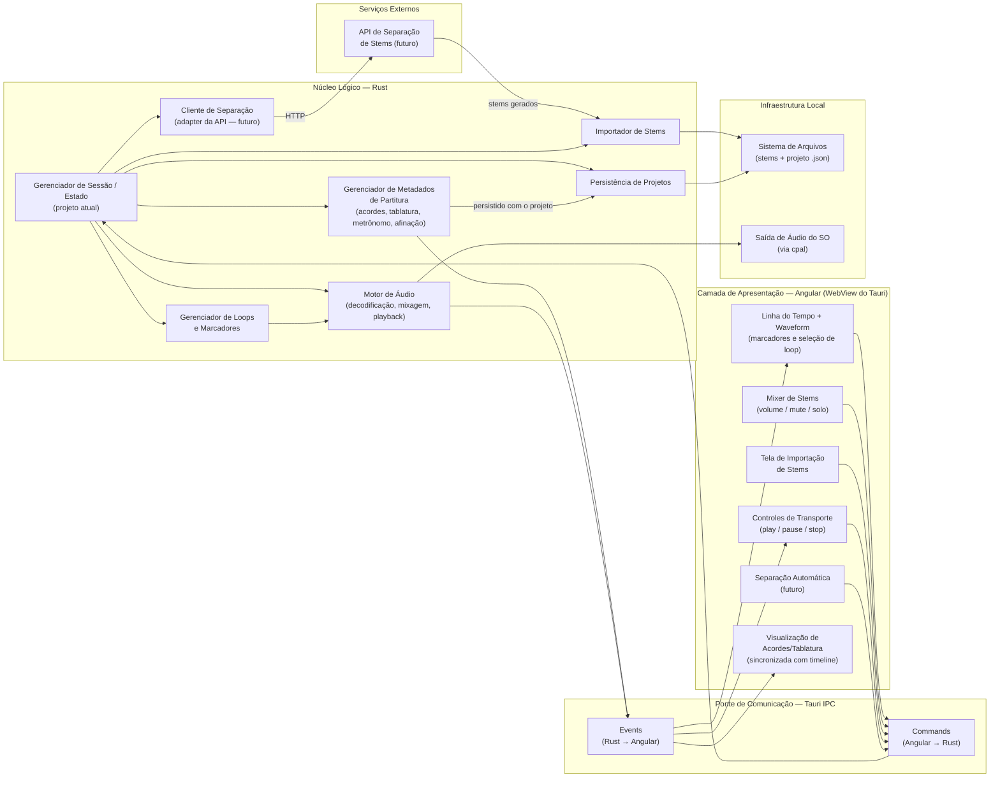
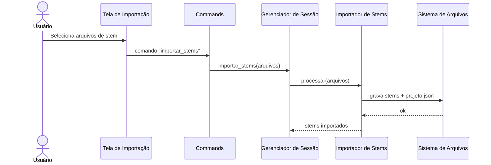
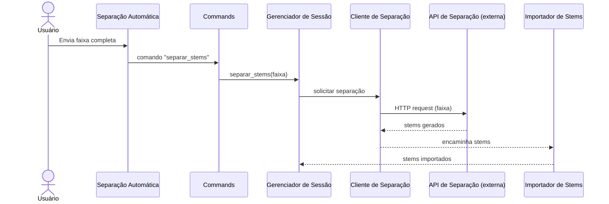
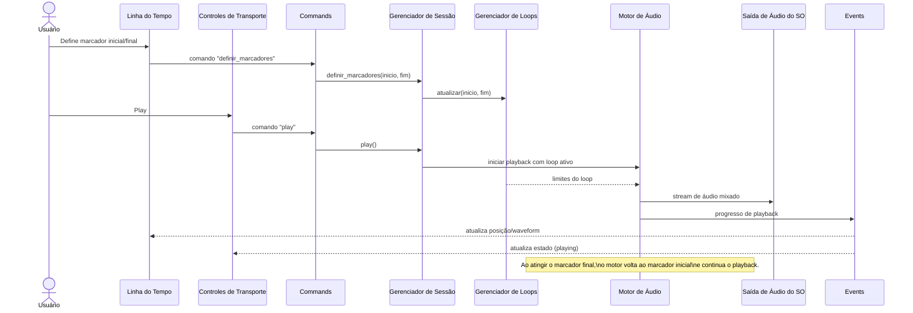
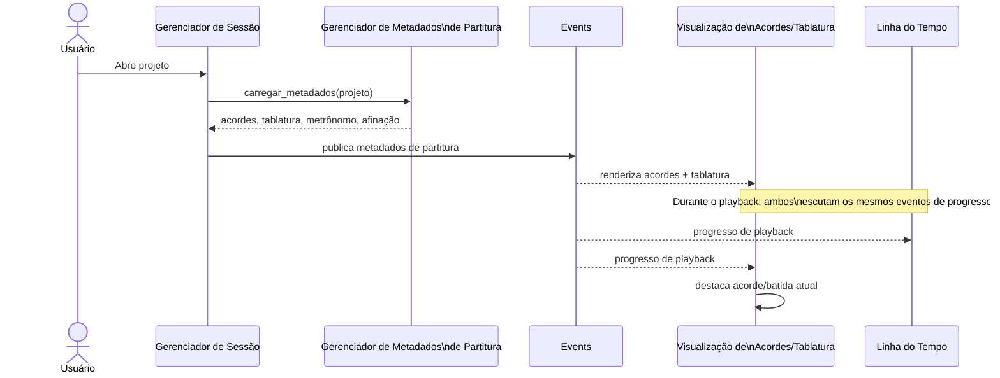

# Stem Player

Aplicativo desktop para reprodução de _stems_ musicais com foco em **criar loops de repetição de trechos por meio de marcadores temporais**.

## Sobre

Stem Player é uma ferramenta de estudo para **músicos iniciantes**. A partir dos stems de uma música (faixas isoladas de cada instrumento), o usuário marca um trecho na linha do tempo e o app o repete continuamente — permitindo praticar a sua parte tocando junto, ou no lugar de, um instrumento da gravação original.

O usuário também controla o mixer de cada stem (volume, mute e solo), podendo, por exemplo, silenciar o instrumento que está aprendendo e tocar por cima.

## Funcionalidade principal

**Loops de repetição por marcadores temporais.** Defina um marcador inicial e um final em um trecho da música e repita-o quantas vezes precisar, no andamento da gravação, com os demais instrumentos soando normalmente.

## Stack e plataforma

O aplicativo é construído sobre **Tauri**: um núcleo lógico em **Rust** (áudio, estado, persistência) embarcado com uma camada de apresentação em **Angular**, rodando dentro da WebView do Tauri. A comunicação entre as duas camadas acontece pela **ponte de IPC do Tauri** (`Commands` e `Events`).

## Visão geral da arquitetura



## Camadas

### Núcleo Lógico — Rust

Contém toda a lógica de domínio do aplicativo, sem dependência da interface gráfica.

| Componente | Responsabilidade |
|---|---|
| **Gerenciador de Sessão / Estado** | Componente central do núcleo (foco atual de desenvolvimento). Orquestra importação, persistência, motor de áudio, loops/marcadores e metadados de partitura; é o ponto de entrada dos `Commands` vindos do Angular. |
| **Importador de Stems** | Recebe arquivos de stem (locais ou vindos da separação automática) e os grava no sistema de arquivos do projeto. |
| **Cliente de Separação** (futuro) | Adapter que fala HTTP com a API externa de separação de stems, encapsulando a integração do restante do núcleo com esse serviço. |
| **Gerenciador de Loops e Marcadores** | Mantém marcador inicial/final do trecho em loop e alimenta o motor de áudio com essa informação para repetição contínua. |
| **Motor de Áudio** | Decodifica, mixa e reproduz os stems; aplica o loop marcado e os estados de volume/mute/solo; emite eventos de progresso/transporte. |
| **Persistência de Projetos** | Serializa/lê o estado do projeto (stems, marcadores, mixagem, metadados de partitura) como arquivo `.json`. |
| **Gerenciador de Metadados de Partitura** | Mantém acordes, tablatura, metrônomo (BPM/fórmula de compasso) e afinação associados ao projeto; persiste esses dados junto com o restante do projeto e os expõe à UI via `Events` para exibição sincronizada com a timeline. |

### Ponte de Comunicação — Tauri IPC

Interface entre a WebView (Angular) e o núcleo Rust.

| Componente | Responsabilidade |
|---|---|
| **Commands (Angular → Rust)** | Chamadas da UI para o núcleo: importar stems, alterar mixer, transporte (play/pause/stop), definir marcadores de loop, disparar separação automática. |
| **Events (Rust → Angular)** | Notificações assíncronas do núcleo para a UI: progresso de playback/waveform para a linha do tempo, mudanças de estado de transporte, dados de acordes/tablatura para a visualização sincronizada. |

### Camada de Apresentação — Angular (WebView do Tauri)

| Componente | Responsabilidade |
|---|---|
| **Mixer de Stems** | Controles de volume, mute e solo por stem. |
| **Tela de Importação de Stems** | Fluxo de seleção/upload de stems para um projeto. |
| **Separação Automática** (futuro) | UI para disparar a separação automática de uma faixa em stems via API externa. |
| **Controles de Transporte** | Play, pause e stop, refletindo o estado emitido pelo motor de áudio. |
| **Linha do Tempo + Waveform** | Visualização da forma de onda, seleção do trecho em loop e posicionamento dos marcadores. |
| **Visualização de Acordes/Tablatura** | Exibe acordes e tablatura por batida, sincronizados com a posição de reprodução na Linha do Tempo. |

### Infraestrutura Local

| Componente | Responsabilidade |
|---|---|
| **Sistema de Arquivos** | Armazena os arquivos de stem e o `.json` do projeto (persistência e importação escrevem aqui). |
| **Saída de Áudio do SO** | Saída real de áudio, acessada pelo motor de áudio via [`cpal`](https://github.com/RustAudio/cpal). |

### Serviços Externos

| Componente | Responsabilidade |
|---|---|
| **API de Separação de Stems** (futuro) | Serviço externo, acessado via HTTP pelo Cliente de Separação, que recebe uma faixa completa e devolve os stems separados. |

## Metadados de partitura (acordes e tablatura)

Além de stems, marcadores e mixagem, o projeto passa a carregar metadados de partitura: acordes, tablatura por batida, metrônomo (BPM e fórmula de compasso) e afinação. É esse dado que alimenta a **Visualização de Acordes/Tablatura**, permitindo ao músico iniciante acompanhar o que tocar enquanto o loop se repete.

```typescript
interface Project {
	id: string; // uuid
	name: string;
	sizeInBeats: number; // 240
	metronome: {
		time: number; // 80 BPM
		beats: number; // 4
	},
	chords: {
		name: string; // G
		beats: number; // 4
		tabs: string[]; // ["3.6", "5.5", "5.4", "3.5"]  ["0.1-1.2-0.3-2.4-3.5"]
	}[],
	tuning: string[], // ["E", "B", "G", "D", "A", "E"]
}
```

No array de `tabs`, cada item representa uma batida. Cada item é representado por `"TRASTE.CORDA"`; o traço `"-"` é usado quando mais de uma corda é tocada ao mesmo tempo. `tuning` lista as 6 cordas da mais aguda (corda 1) à mais grave (corda 6) — `["E", "B", "G", "D", "A", "E"]` é a afinação padrão.

A parte "TRASTE" de cada item não precisa ser só um número — ela aceita as técnicas de guitarra encadeadas na mesma corda, no formato `<traste><técnica><traste>...`:

| Símbolo | Técnica | Exemplo | Significado |
|---|---|---|---|
| `h` | Hammer-on | `5h7` | Toca o traste 5 e soa o 7 na mesma corda, sem repicar |
| `p` | Pull-off | `7p5` | Toca o traste 7 e solta para soar o 5, sem repicar |
| `b` | Bend | `7b9` | Puxa a corda no traste 7 até soar como o traste 9 |
| `r` | Release | `7b9r7` | Bend seguido da liberação de volta ao traste 7 |
| `/` | Slide ascendente | `5/7` | Desliza do traste 5 até o 7 |
| `\` | Slide descendente | `7\5` | Desliza do traste 7 até o 5 (no JSON: `"7\\5"`) |
| `~` | Vibrato | `8~` | Vibra a nota no traste 8 |

As técnicas podem ser combinadas em sequência no mesmo item, como no exemplo abaixo (`8~~b10r8` = toca o traste 8, aplica vibrato, faz bend até soar como o 10 e libera de volta ao 8).

Visualmente, uma progressão de acordes deve ficar assim:

```
   G                              F    C
E|---------3---------------3------1----0----| 
B|-----------3---------------3----1----1----| 
G|-------4-----4---------4-----4--2----0----| 
D|-----5---------5-----5----------3----2----| 
A|---5---------------5------------3----3----| 
E|-3---------------3--------------1---------|
```

E um trecho melódico com técnicas (bend/release), assim:

```
E|----------------------------------------------------| 
B|-8~~b10r8--8~~b12r8--8~b12r-b10~~b12r8--------------| 
G|----------------------------------------------------| 
D|----------------------------------------------------| 
A|----------------------------------------------------| 
E|----------------------------------------------------|
```

### Exemplo completo

Progressão de estudo em Sol maior (G · C · D · G), 80 BPM, 4/4 — 4 compassos de 4 batidas, terminando no mesmo acorde em que começa para o loop fechar sem costura:

```json
{
  "id": "b3a1e6c2-8f21-4d9a-9c3e-1a2b3c4d5e6f",
  "name": "Estudo em Sol Maior",
  "sizeInBeats": 16,
  "metronome": { "time": 80, "beats": 4 },
  "chords": [
    { "name": "G", "beats": 4, "tabs": ["3.6", "2.5", "0.4-0.3-0.2", "3.1"] },
    { "name": "C", "beats": 4, "tabs": ["3.5", "2.4", "0.3-1.2", "0.1"] },
    { "name": "D", "beats": 4, "tabs": ["0.4", "2.3", "3.2", "2.1"] },
    { "name": "G", "beats": 4, "tabs": ["3.6", "2.5", "0.4-0.3-0.2", "3.1"] }
  ],
  "tuning": ["E", "B", "G", "D", "A", "E"]
}
```

### Exemplo com técnicas

Uma frase em Lá menor pentatônica cobrindo hammer-on, pull-off, bend com release, slide ascendente/descendente e vibrato — tudo dentro de um único acorde "Am", já que a frase não troca de harmonia:

```json
{
  "id": "f4a2e9d1-73b5-4a2e-8c1f-9d6b2a7e0c44",
  "name": "Frase com técnicas — Lá menor pentatônica",
  "sizeInBeats": 8,
  "metronome": { "time": 100, "beats": 4 },
  "chords": [
    {
      "name": "Am",
      "beats": 8,
      "tabs": ["5h8.2", "8p5.2", "7.3", "5/7.4", "7\\5.4", "7b9.3", "7b9r7.3", "8~.2"]
    }
  ],
  "tuning": ["E", "B", "G", "D", "A", "E"]
}
```

- Batida 1–2: hammer-on `5h8` seguido de pull-off `8p5`, na corda B.
- Batida 4–5: slide ascendente `5/7` e descendente `7\5`, na corda D.
- Batida 6–7: bend `7b9` e bend com release `7b9r7`, na corda G.
- Batida 8: vibrato `8~`, na corda B.

Visualmente:

```
E|----------------------------------------------------------------|
B|-5h8-----8p5---------------------------------------------8~-----|
G|-----------------7-----------------------7b9-----7b9r7----------|
D|-------------------------5/7-----7\5----------------------------|
A|----------------------------------------------------------------|
E|----------------------------------------------------------------|
```

### Como fica na tela

Renderização da mesma progressão na Linha do Tempo + Waveform, com a Visualização de Acordes/Tablatura sincronizada abaixo: acordes por compasso, região de loop ativa, e a tablatura correspondente a cada batida.


Mockup interativo (com fader e destaque de traste ao passar o mouse): [Acordes & Tablatura](https://claude.ai/code/artifact/af5ed906-86c6-4d45-989e-49065383c682).

## Fluxos principais

### Importação de stems (manual)



### Separação automática (futuro)



### Reprodução com loop de marcadores



### Visualização de acordes/tablatura sincronizada



## Estado atual e trabalho futuro

- **Em desenvolvimento agora:** Gerenciador de Sessão / Estado, e por extensão os fluxos que ele orquestra diretamente (importação manual, persistência, motor de áudio, loops/marcadores, mixer, transporte, timeline).
- **Metadados de partitura:** Gerenciador de Metadados de Partitura e Visualização de Acordes/Tablatura mapeiam acordes, tablatura, metrônomo e afinação persistidos junto do projeto, exibidos sincronizados com a timeline — não marcados como "futuro" no canvas, entram junto do desenvolvimento atual.
- **Planejado para o futuro:** separação automática de stems, tanto na ponta da UI ("Separação Automática") quanto no núcleo ("Cliente de Separação") e no serviço externo ("API de Separação de Stems"), integrando-se ao fluxo de importação já existente.
