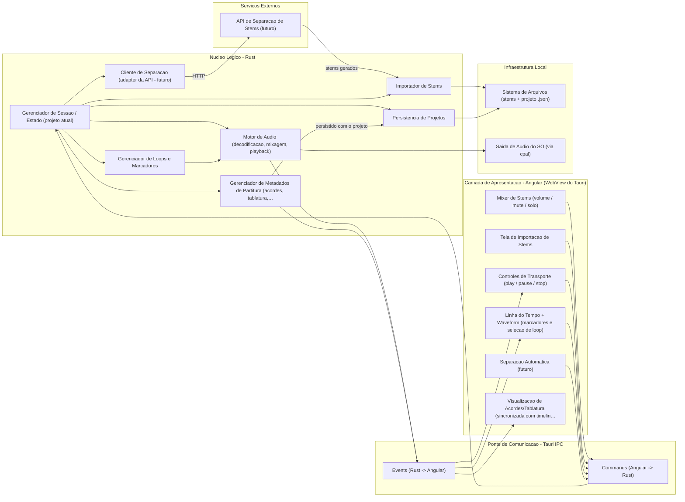
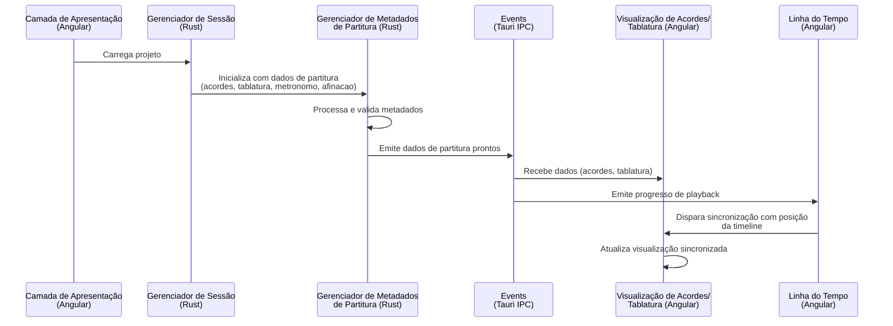

# Stem Player

## Metadata

```typescript
interface Project {
	id: string; // uuid
	name: string;
	sizeInBeats: number; // 240
	metronome: {
		time: number; // 80 BPM
		beats: number; // 4
	},
	chords: {
		name: string; // G
		beats: number; // 4
		tabs: string[]; // ["3.6", "5.5", "5.4", "3.5"]  ["0.1-1.2-0.3-2.4-3.5"]
	}[],
	tuning: string[], // ["E", "B", "G", "D", "A", "E"]
}
```

No array de Tabs cada item representa uma batida. Cada item no array é representado por "TRASTE.CORDA". O traço "-" é usado caso mais de uma corda é tocada ao mesmo tempo.

Visualmente deve ficar assim:

```
   G                              F    C
E|---------3---------------3------1----0----| 
B|-----------3---------------3----1----1----| 
G|-------4-----4---------4-----4--2----0----| 
D|-----5---------5-----5----------3----2----| 
A|---5---------------5------------3----3----| 
E|-3---------------3--------------1---------|
```

```
E|----------------------------------------------------| 
B|-8~~b10r8--8~~b12r8--8~b12r-b10~~b12r8--------------| 
G|----------------------------------------------------| 
D|----------------------------------------------------| 
A|----------------------------------------------------| 
E|----------------------------------------------------|
```


Aplicativo desktop para reprodução de _stems_ musicais com foco em **criar loops de repetição de trechos por meio de marcadores temporais**.

## Sobre

Stem Player é uma ferramenta de estudo para **músicos iniciantes**. A partir dos stems de uma música (faixas isoladas de cada instrumento), o usuário marca um trecho na linha do tempo e o app o repete continuamente — permitindo praticar a sua parte tocando junto, ou no lugar de, um instrumento da gravação original.

O usuário também controla o mixer de cada stem (volume, mute e solo), podendo, por exemplo, silenciar o instrumento que está aprendendo e tocar por cima.

## Funcionalidade principal

**Loops de repetição por marcadores temporais.** Defina um marcador inicial e um final em um trecho da música e repita-o quantas vezes precisar, no andamento da gravação, com os demais instrumentos soando normalmente.

## Visão geral da arquitetura



## Fluxos principais

### Carregamento e sincronização de metadados de partitura



## Nucleo Logico - Rust

| Componente | Descrição |
|---|---|
| Gerenciador de Sessao / Estado (projeto atual) | Gerenciador de Sessao / Estado (projeto atual) |
| Importador de Stems | Importador de Stems |
| Motor de Audio (decodificacao, mixagem, playback) | Motor de Audio (decodificacao, mixagem, playback) |
| Cliente de Separacao (adapter da API - futuro) | Cliente de Separacao (adapter da API - futuro) |
| Gerenciador de Loops e Marcadores | Gerenciador de Loops e Marcadores |
| Persistencia de Projetos | Persistencia de Projetos |
| Gerenciador de Metadados de Partitura (acordes, tablatura, metronomo, afinacao) | Gerenciador de Metadados de Partitura (acordes, tablatura, metronomo, afinacao) |

## Camada de Apresentacao - Angular (WebView do Tauri)

| Componente | Descrição |
|---|---|
| Mixer de Stems (volume / mute / solo) | Mixer de Stems (volume / mute / solo) |
| Tela de Importacao de Stems | Tela de Importacao de Stems |
| Separacao Automatica (futuro) | Separacao Automatica (futuro) |
| Controles de Transporte (play / pause / stop) | Controles de Transporte (play / pause / stop) |
| Linha do Tempo + Waveform (marcadores e selecao de loop) | Linha do Tempo + Waveform (marcadores e selecao de loop) |
| Visualizacao de Acordes/Tablatura (sincronizada com timeline) | Visualizacao de Acordes/Tablatura (sincronizada com timeline) |

## Ponte de Comunicacao - Tauri IPC

| Componente | Descrição |
|---|---|
| Commands (Angular -> Rust) | Commands (Angular -> Rust) |
| Events (Rust -> Angular) | Events (Rust -> Angular) |

## Infraestrutura Local

| Componente | Descrição |
|---|---|
| Sistema de Arquivos (stems + projeto .json) | Sistema de Arquivos (stems + projeto .json) |
| Saida de Audio do SO (via cpal) | Saida de Audio do SO (via cpal) |

## Servicos Externos

| Componente | Descrição |
|---|---|
| API de Separacao de Stems (futuro) | API de Separacao de Stems (futuro) |

## Estado atual e trabalho futuro

### Funcionalidade atual / planejada imediata

Os componentes abaixo já estão incorporados ou planejados como parte da arquitetura atual e não possuem marcação de futuro:

- **Gerenciador de Metadados de Partitura** (Rust): responsável por processar, validar e manter em sincronização os dados de partitura (acordes, tablatura, metronomo, afinação), persistindo-os junto com o projeto.
- **Visualização de Acordes/Tablatura** (Angular): renderiza dinamicamente os acordes e tablatura, mantendo sincronização com a linha do tempo durante a reprodução.
- **Gerenciador de Sessão / Estado**: orquestra o carregamento de projetos e inicialização de todos os componentes.
- **Importador de Stems**: processa stems de áudio de forma determinística.
- **Motor de Audio**: decodifica, mescla e reproduz stems com sincronização de timeline.
- **Mixer de Stems**: interface para controle de volume, mute e solo por stem.
- **Linha do Tempo + Waveform**: marca trechos de loop e sincroniza com metadados de partitura.
- **Ponte de Comunicação (Tauri IPC)**: facilita comunicação entre Angular (frontend) e Rust (backend).

### Funcionalidade futura

Os componentes abaixo estão marcados como "(futuro)" e representam expansões de escopo planejadas:

- **Cliente de Separação (adapter da API)**: adapter para integração com serviços externos de separação de stems (e.g., API de IA para isolar instrumentos).
- **Separação Automática (Angular)**: interface do usuário para disparo de separação automática via API externa.
- **API de Separação de Stems**: serviço externo de processamento de áudio (não implementado localmente).
