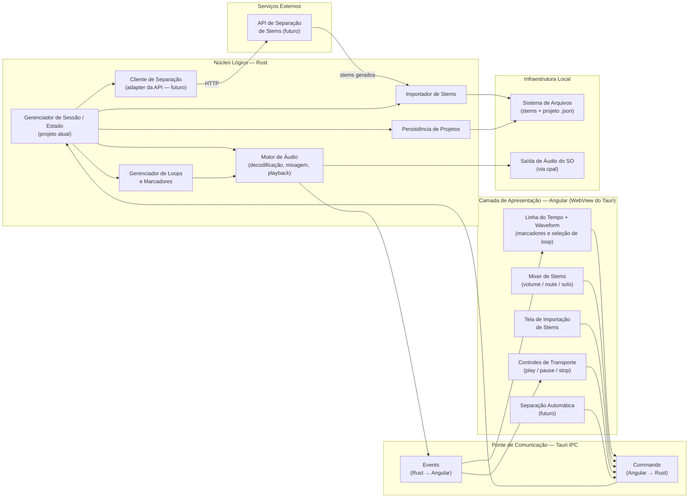
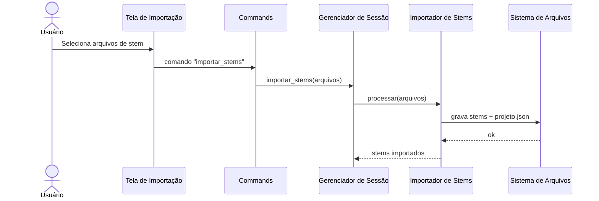
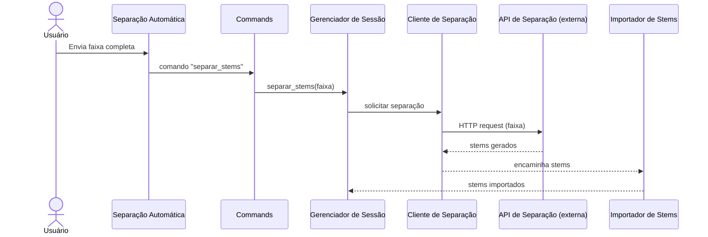

# Stem Player

Aplicativo desktop para reprodução de _stems_ musicais com foco em **criar loops de repetição de trechos por meio de marcadores temporais**.

## Sobre

Stem Player é uma ferramenta de estudo para **músicos iniciantes**. A partir dos stems de uma música (faixas isoladas de cada instrumento), o usuário marca um trecho na linha do tempo e o app o repete continuamente — permitindo praticar a sua parte tocando junto, ou no lugar de, um instrumento da gravação original.

O usuário também controla o mixer de cada stem (volume, mute e solo), podendo, por exemplo, silenciar o instrumento que está aprendendo e tocar por cima.

## Funcionalidade principal

**Loops de repetição por marcadores temporais.** Defina um marcador inicial e um final em um trecho da música e repita-o quantas vezes precisar, no andamento da gravação, com os demais instrumentos soando normalmente.

## Stack e plataforma

O aplicativo é construído sobre **Tauri**: um núcleo lógico em **Rust** (áudio, estado, persistência) embarcado com uma camada de apresentação em **Angular**, rodando dentro da WebView do Tauri. A comunicação entre as duas camadas acontece pela **ponte de IPC do Tauri** (`Commands` e `Events`).

## Visão geral da arquitetura



## Camadas

### Núcleo Lógico — Rust

Contém toda a lógica de domínio do aplicativo, sem dependência da interface gráfica.

| Componente | Responsabilidade |
|---|---|
| **Gerenciador de Sessão / Estado** | Componente central do núcleo (foco atual de desenvolvimento). Orquestra importação, persistência, motor de áudio e loops/marcadores; é o ponto de entrada dos `Commands` vindos do Angular. |
| **Importador de Stems** | Recebe arquivos de stem (locais ou vindos da separação automática) e os grava no sistema de arquivos do projeto. |
| **Cliente de Separação** (futuro) | Adapter que fala HTTP com a API externa de separação de stems, encapsulando a integração do restante do núcleo com esse serviço. |
| **Gerenciador de Loops e Marcadores** | Mantém marcador inicial/final do trecho em loop e alimenta o motor de áudio com essa informação para repetição contínua. |
| **Motor de Áudio** | Decodifica, mixa e reproduz os stems; aplica o loop marcado e os estados de volume/mute/solo; emite eventos de progresso/transporte. |
| **Persistência de Projetos** | Serializa/lê o estado do projeto (stems, marcadores, mixagem) como arquivo `.json`. |

### Ponte de Comunicação — Tauri IPC

Interface entre a WebView (Angular) e o núcleo Rust.

| Componente | Responsabilidade |
|---|---|
| **Commands (Angular → Rust)** | Chamadas da UI para o núcleo: importar stems, alterar mixer, transporte (play/pause/stop), definir marcadores de loop, disparar separação automática. |
| **Events (Rust → Angular)** | Notificações assíncronas do núcleo para a UI: progresso de playback/waveform para a linha do tempo, mudanças de estado de transporte. |

### Camada de Apresentação — Angular (WebView do Tauri)

| Componente | Responsabilidade |
|---|---|
| **Mixer de Stems** | Controles de volume, mute e solo por stem. |
| **Tela de Importação de Stems** | Fluxo de seleção/upload de stems para um projeto. |
| **Separação Automática** (futuro) | UI para disparar a separação automática de uma faixa em stems via API externa. |
| **Controles de Transporte** | Play, pause e stop, refletindo o estado emitido pelo motor de áudio. |
| **Linha do Tempo + Waveform** | Visualização da forma de onda, seleção do trecho em loop e posicionamento dos marcadores. |

### Infraestrutura Local

| Componente | Responsabilidade |
|---|---|
| **Sistema de Arquivos** | Armazena os arquivos de stem e o `.json` do projeto (persistência e importação escrevem aqui). |
| **Saída de Áudio do SO** | Saída real de áudio, acessada pelo motor de áudio via [`cpal`](https://github.com/RustAudio/cpal). |

### Serviços Externos

| Componente | Responsabilidade |
|---|---|
| **API de Separação de Stems** (futuro) | Serviço externo, acessado via HTTP pelo Cliente de Separação, que recebe uma faixa completa e devolve os stems separados. |

## Fluxos principais

### Importação de stems (manual)



### Separação automática (futuro)



### Reprodução com loop de marcadores

```mermaid
sequenceDiagram
    actor Usuário
    participant TIMELINE as Linha do Tempo
    participant TRANSPORT as Controles de Transporte
    participant CMD as Commands
    participant SESSION as Gerenciador de Sessão
    participant LOOP as Gerenciador de Loops
    participant AUDIO as Motor de Áudio
    participant OS as Saída de Áudio do SO
    participant EVT as Events

    Usuário->>TIMELINE: Define marcador inicial/final
    TIMELINE->>CMD: comando "definir_marcadores"
    CMD->>SESSION: definir_marcadores(inicio, fim)
    SESSION->>LOOP: atualizar(inicio, fim)

    Usuário->>TRANSPORT: Play
    TRANSPORT->>CMD: comando "play"
    CMD->>SESSION: play()
    SESSION->>AUDIO: iniciar playback com loop ativo
    LOOP-->>AUDIO: limites do loop
    AUDIO->>OS: stream de áudio mixado
    AUDIO->>EVT: progresso de playback
    EVT-->>TIMELINE: atualiza posição/waveform
    EVT-->>TRANSPORT: atualiza estado (playing)

    Note over AUDIO: Ao atingir o marcador final,\no motor volta ao marcador inicial\ne continua o playback.
```

## Estado atual e trabalho futuro

- **Em desenvolvimento agora:** Gerenciador de Sessão / Estado, e por extensão os fluxos que ele orquestra diretamente (importação manual, persistência, motor de áudio, loops/marcadores, mixer, transporte, timeline).
- **Planejado para o futuro:** separação automática de stems, tanto na ponta da UI ("Separação Automática") quanto no núcleo ("Cliente de Separação") e no serviço externo ("API de Separação de Stems"), integrando-se ao fluxo de importação já existente.
